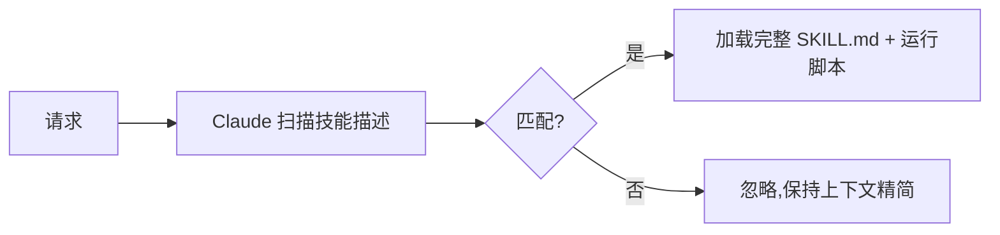

<LevelBadge level="advanced" />

<VerifyNote lastVerified="2026-06-23" source="https://code.claude.com/docs/en/skills">
技能文件的布局、渐进式披露以及技能在哪里运行（Claude Code、Claude.ai、Cowork）都在演进——请以官方技能文档为准。
</VerifyNote>

一个**技能**打包了专长——指令外加可选的脚本和资源——Claude **仅在相关时**才加载它。与其把一切都塞进 [CLAUDE.md](/docs/claude-code/claude-md)，不如给 Claude 一个能力库，让它按需取用。

## 结构剖析

一个技能是一个含有 `SKILL.md` 的文件夹：YAML 前置元数据 + 指令。

```markdown
---
name: pdf-forms
description: Use when the user needs to fill, read, or generate PDF forms.
---

# PDF Forms
Steps and rules for working with PDF forms…
(optionally reference scripts/ or resources/ in this folder)
```

**`description` 就是触发器**——Claude 读取它来决定*何时*激活该技能。把它写成“Use when……”，具体到既能在恰当的时机加载、又不会在别的时候误触发。

## 渐进式披露（技能为何可扩展）

Claude 不会一开始就加载每个技能的完整正文——它看到的是轻量的 `name` + `description`，只有当请求匹配时才拉入完整指令（并运行脚本）。这让上下文即便在安装了很多技能时也能保持精简。



## 它们存放在哪里

- 个人：`~/.claude/skills/<name>/SKILL.md`
- 项目（可共享）：`.claude/skills/<name>/SKILL.md`
- 打包进一个[插件](/docs/claude-code/plugins-marketplaces)以供团队分发。

AILmanac 提供了 [7 个现成的技能包](/docs/templates/skills)——拷贝一个进来试试。

## 实战示例：一个会自我触发的技能

创建 `~/.claude/skills/release-notes/SKILL.md`：

```markdown
---
name: release-notes
description: Use when the user asks to write release notes or a changelog from git history.
---

# Release Notes
1. Run `git log <last-tag>..HEAD --oneline` to get the commits.
2. Group them into Features / Fixes / Breaking changes.
3. Write user-facing notes — what changed for *users*, not commit messages.
4. Output Markdown ready to paste into a GitHub release.
```

之后你输入：*“Draft release notes since v1.4.”* Claude 的上下文里从未有过这些步骤——但请求匹配了 `description`，于是它拉入完整的 `SKILL.md`，运行那个 `git log`，并产出分好组的发布说明。你没有按名字调用任何东西；是 **description 做了路由**。在同一个文件夹里加一个 `scripts/` 文件，技能就能把它作为第 1 步的一部分来运行。

## 技能 vs 命令 vs 子智能体 vs MCP

| 工具 | 它是什么 | 由你还是 Claude 触发 |
|---|---|---|
| [斜杠命令](/docs/claude-code/slash-commands) | 一段保存好的提示 | **你**调用它 |
| **技能** | 按需的专长 + 脚本 | **Claude** 在相关时加载它 |
| [子智能体](/docs/claude-code/subagents) | 一个拥有自身上下文的受委派智能体 | Claude 委派 |
| [MCP](/docs/claude-code/mcp) | 到外部工具/数据的连接 | 提供可调用的工具 |

经验法则：**你**想按需触发它 → 斜杠命令。**Claude** 应该知道这套流程并在相关时应用它 → 技能。这项工作应该在一个独立的上下文中发生 → 子智能体。你需要触达一个外部系统 → MCP。

## 常见错误

- **一个不会触发的描述。** “Helps with PDFs”太含糊；“Use when the user needs to fill, read, or generate PDF forms”则准确告诉 Claude 何时加载它。描述就是整个激活机制——为匹配而写，不是为人而写。
- **反而把一切放进 CLAUDE.md。** [CLAUDE.md](/docs/claude-code/claude-md) 在*每个*会话都加载、始终占用上下文；技能则*仅在相关时*加载。把情境化的流程挪进技能，让 CLAUDE.md 保留始终成立的项目规则。
- **一个巨型技能。** 许多小而描述精准的技能比一个包揽一切的技能路由得更好——渐进式披露只有在每个描述都具体时才有帮助。
- **忘了它是可共享的。** 一个放在 `.claude/skills/` 并提交进 git 的项目技能，会把这个能力给整个团队；而一个放在 `~/.claude/skills/` 的个人技能则只属于你。

## 下一步

- [编写你的第一个技能（实战演练）](/docs/walkthroughs/first-skill)
- [SKILL.md 模板](/docs/templates/skills)
- [插件与市场](/docs/claude-code/plugins-marketplaces)
