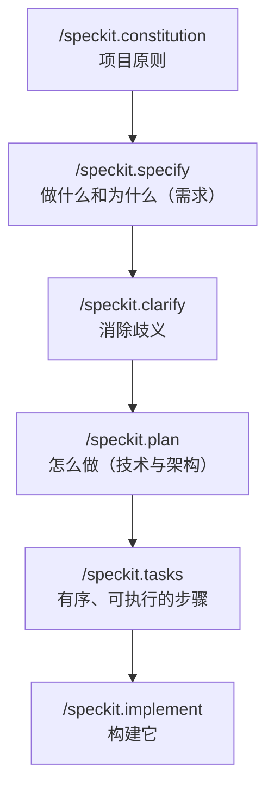

<LevelBadge level="intermediate" />

# 使用 Spec Kit 进行规格驱动开发

氛围编程——"给我做个仪表盘"，然后照单全收返回的东西——在功能不大时效果很好。可一旦功能变大，智能体就开始漂移：它会忘掉早先的某个决定、重新发明一个函数，或者交付一个技术上能跑、却不是你本意的东西。**规格驱动开发（Spec-Driven Development，SDD）** 正是 2026 年在智能体编程圈子里流行开来的解法：与其把提示词当作一次性用品，不如让一份**可书面化、可评审的规格成为唯一事实来源**，让智能体*据此*生成代码。

GitHub 的开源工具 **[Spec Kit](https://github.com/github/spec-kit)** 把这个理念变成了一套你今天就能在 Claude Code 里运行的具体工作流。

<Callout type="objectives" items={["理解什么是规格驱动开发，以及它解决了什么问题", "走一遍 Spec Kit 的各个阶段：constitution → specify → plan → tasks → implement", "安装 Specify CLI 并将其接入 Claude Code", "了解可选的质量关卡（clarify、analyze、checklist）", "判断什么时候 SDD 的额外开销值得，什么时候该跳过它"]} />

<VerifyNote lastVerified="2026-06-28" source="https://github.com/github/spec-kit">
Spec Kit 发展很快（约 116k★，MIT 许可）。命令名称、`specify init` 的智能体选择标志，以及受支持的工具会在不同版本间变化——在依赖确切语法之前，请先在仓库 README 中确认当前的快速上手说明。下文的斜杠命令名称使用了近期版本引入的 `/speckit.*` 命名空间。
</VerifyNote>

## 为什么要规格，而不只是提示词

提示词在这一轮对话结束的瞬间就消失了。而**规格是一件制品**：它可以被阅读、在 PR 中评审、被修正、被重新运行。仅仅这一个转变，就修复了大型智能体构建出错的三种方式：

- **漂移** —— 智能体与早先的决定相矛盾，因为没有任何东西把它记下来。规格就是记忆。
- **歧义** —— "做得好看点"可以有十种不同的含义。强迫把需求写成文字，会在代码出现*之前*就暴露出空白，那时修复成本最低。
- **无法评审的 diff** —— 一个 2000 行的生成式 PR 很难判断。一份经过评审的规格 + 计划，让 diff 变得*在预期之内*，而不是出人意料。

心智模型是：**意图是高价值、持久的东西；代码是下游的、可重新生成的制品。** SDD 是 Claude Code 自带 [Plan Mode](/docs/claude-code/plan-mode) 的纪律化"远亲"——先规划，再构建——只不过被放大到了整个功能的尺度，并持久化为你仓库里的文件。

## Spec Kit 工作流

Spec Kit 把一个功能组织成一条由斜杠命令构成的短流水线。每一步都会把 Markdown 制品写入你的仓库（位于 `.specify/` 下），所以每个阶段都可检视、可纳入版本控制。

<Steps items={[{title: "Constitution", body: "每个项目运行一次 /speckit.constitution。它会把治理性原则——代码风格、测试标准、不可妥协的架构约定——写入 .specify/memory/constitution.md。之后每个阶段都会对照它检查，所以这是你持久的护栏（可以把它想成一份专注于原则的 CLAUDE.md）。"}, {title: "Specify", body: "运行 /speckit.specify，描述你要构建的是什么（WHAT）以及为什么（WHY）——用户故事、需求、成功标准。刻意不要写技术栈。智能体会产出一份结构化的规格，供你在继续之前阅读和修正。"}, {title: "Plan", body: "带上你的技术选型运行 /speckit.plan——框架、数据存储、约束。此时会写下怎么做（HOW）：架构、各个组件，以及它们如何满足规格。技术决策住在这里，而不在规格里，这样规格才能保持与实现无关。"}, {title: "Tasks", body: "运行 /speckit.tasks，把计划拆解成一份编号、有序的小步骤清单，每一步都可单独评审。这正是让整个构建可审计的关键——在写任何代码之前，你就能看到执行顺序。"}, {title: "Implement", body: "运行 /speckit.implement，智能体会执行这份任务清单，对照计划和 constitution 构建功能。因为之前每个阶段都已评审，最终的 diff 是预期之内的，而不是意外。"}]} />

### 可选的质量关卡

还有三个命令，能在功能事关重大时收紧整个闭环：

- **`/speckit.clarify`** —— 审讯规格中描述不足的部分，并在*规划之前*向你提出有针对性的问题。最好紧接着 `specify` 之后运行。
- **`/speckit.analyze`** —— 交叉核对规格、计划与任务，检查一致性和覆盖空缺。
- **`/speckit.checklist`** —— 生成一份验证清单，让"完成"有明确定义且可测试。

<Callout type="tip" items={["在 /speckit.plan 之前运行 /speckit.clarify——在架构定型之前修复歧义成本最低。", "把每一件生成的制品都当作 PR 来对待：阅读它、修正它，然后才推进到下一个阶段。", "提交 .specify/ 制品——它们是代码背后意图的可评审记录。"]} />

## 在 Claude Code 中跑起来

Spec Kit 附带一个名为 **Specify** 的 CLI，它会把斜杠命令脚手架写入你的项目。它支持 30 多种编程智能体，Claude Code 是其中之一。

<Steps items={[{title: "安装 Specify CLI", body: "用 uv 从仓库安装它。（需要 Python + uv。）"}, {title: "初始化一个项目", body: "搭建 .specify/ 结构和智能体命令。在新仓库或现有仓库中运行 init；出现提示时，选择 Claude Code 作为你的智能体（或传入 README 中当前的集成标志）。"}, {title: "打开 Claude Code 并检查命令", body: "在项目文件夹里启动 claude。当 /speckit.constitution、/speckit.specify、/speckit.plan、/speckit.tasks 和 /speckit.implement 作为斜杠命令出现时，你就知道它已经接好了。"}]} />

<PromptCard title="Install the Specify CLI (uv)">{`uv tool install specify-cli --from git+https://github.com/github/spec-kit.git`}</PromptCard>

<PromptCard title="Scaffold spec-driven workflow into a project">{`# new project
specify init my-feature

# or in the current repo
specify init --here`}</PromptCard>

<PromptCard title="Then, inside Claude Code, run the pipeline">{`/speckit.constitution Establish principles: TypeScript strict, tests for every public function, no secrets in code.
/speckit.specify Build a CSV export for the reports page: users pick a date range and download a CSV of matching rows.
/speckit.clarify
/speckit.plan Next.js App Router, server action for the query, stream the CSV; no new dependencies.
/speckit.tasks
/speckit.implement`}</PromptCard>

<Callout type="warning" items={["specify init 用于选择智能体的确切标志会在不同版本间变化——请查阅 README 的快速上手说明，而不要盲目照抄某个标志。", "SDD 并不能免除你验证的必要：阅读生成的代码并运行它。规格让 diff 变得可评审，并不意味着它自动正确。", "永远不要把密钥或凭据放进规格、计划或 constitution——它们会像任何其他文件一样被提交。"]} />

## 何时使用它（以及何时不用）

SDD 用前期的仪式换取掌控力。当工作量大、含糊不清，或必须由他人评审时，这笔交易是划算的——而当并非如此时，它就是纯粹的额外开销。

<Callout type="info" items={["该用 SDD：全新功能、跨多文件的构建、任何需要队友评审的东西，或者你要交给一支子智能体队伍去做的工作。", "跳过 SDD：一次性脚本、微小修复、探索性的一次性代码——一句普通提示词或 Plan Mode 更快。", "棕地项目同样适用：把 /speckit.specify 对准对现有代码库的一次增强，而不只是新项目。"]} />

<Flashcards title="SDD at a glance" cards={[{front: "在 SDD 中，唯一事实来源是什么？", back: "那份书面规格。代码是位于它下游、可重新生成的制品。"}, {front: "/speckit.constitution 做什么？", back: "写下持久的项目原则（风格、测试标准、架构规则），之后每个阶段都会对照它检查。"}, {front: "技术栈决策属于哪里？", back: "属于 /speckit.plan——而不是规格。规格保持与实现无关（做什么和为什么）；计划才是怎么做。"}, {front: "是什么让 Spec Kit 的构建可审计？", back: "/speckit.tasks 会在任何代码写出之前产出一份有序、可评审的任务清单，而且每个阶段都会写出可检视的 Markdown 制品。"}, {front: "什么时候不该使用 SDD？", back: "一次性脚本、微小修复，或一次性探索——那点仪式付出的成本比省下的还多。"}]} />

## 自测一下

<Quiz title="Check yourself" questions={[{q: "规格驱动开发的核心理念是什么？", options: ["写更详尽的一次性提示词", "让一份可评审的规格成为唯一事实来源，并据此生成代码", "跳过规划，让智能体即兴发挥"], answer: 1, explain: "SDD 把意图当作持久、高价值的制品，把代码当作下游、可重新生成的产物——这与一次性提示词式的氛围编程恰好相反。"}, {q: "Spec Kit 的哪个阶段应当捕捉技术栈和架构？", options: ["/speckit.specify", "/speckit.plan", "/speckit.constitution"], answer: 1, explain: "specify 描述做什么和为什么（与实现无关）；plan 才是决定怎么做——框架、数据存储、架构——的地方。"}, {q: "什么时候规格驱动开发不值得这份额外开销？", options: ["一个需要队友评审、跨多文件的全新功能", "一个一次性的一行脚本或微小修复", "任何你要交给子智能体去做的工作"], answer: 1, explain: "SDD 的前期仪式在大型、含糊或需评审的工作上会有回报。对于微不足道的修复，一句普通提示词或 Plan Mode 更快。"}]} />

<Callout type="takeaways" items={["规格驱动开发让一份可评审的规格——而不是提示词——成为唯一事实来源，消灭漂移、歧义和无法评审的 diff。", "GitHub 的 Spec Kit（即 Specify CLI）把 SDD 以 /speckit.* 斜杠命令的形式带入 Claude Code。", "流水线是 constitution → specify →（clarify）→ plan →（analyze）→ tasks →（checklist）→ implement，每一步都写出可检视的制品。", "把做什么/为什么留在规格里，把怎么做留在计划里；在推进之前像评审 PR 一样评审每一件制品。", "把它用在大型、含糊或需评审的功能上；一次性工作就跳过它——并且始终仍要验证生成的代码。"]} />

## 下一步

- [Plan Mode](/docs/claude-code/plan-mode) —— 内置、更轻量的"构建前先规划"闭环
- [Slash Commands](/docs/claude-code/slash-commands) —— /speckit.* 命令如何融入 Claude Code 的命令系统
- [CLAUDE.md & Memory Files](/docs/claude-code/claude-md) —— constitution 背后"原则即记忆"的理念
- [Subagents](/docs/claude-code/subagents) —— 把一份已评审的任务清单交给一支智能体队伍
- [Coding & Software Development](/docs/playbooks/coding) —— SDD 所依赖的"凡事都要验证"心态

## 来源与延伸阅读

- [github/spec-kit — Toolkit for Spec-Driven Development](https://github.com/github/spec-kit)（MIT）
- [Spec Kit README & quickstart](https://github.com/github/spec-kit/blob/main/README.md)
- [Anthropic — Plan Mode in Claude Code](https://code.claude.com/docs/en/interactive-mode)
