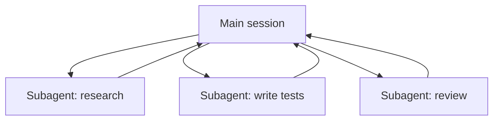

<LevelBadge level="advanced" />

<VerifyNote lastVerified="2026-06-20" source="https://docs.anthropic.com/en/docs/claude-code/sub-agents">
子智能体的配置以及 `/agents` 界面会随时间变化——请以官方文档为准。
</VerifyNote>

一个**子智能体**是一个独立的 Claude 实例，拥有**自己的上下文窗口**和一套**受限的工具**，你的主会话把一大块工作委派给它。它回报的是一个结果，而非它的整段记录——因此主会话保持聚焦、不被杂乱拖累。

## 为什么要委派

- **保护主上下文。** 一次研究深挖或一次大文件扫读可能烧掉数千 token；在子智能体里做，只有结论会返回。
- **专门化。** 给子智能体一个量身定制的系统提示，并只给它所需的工具（例如一个只读的审查者）。
- **并行化。** 同时运行互相独立的子任务——例如同时探查三个模块。

## 如何定义它们

子智能体被配置为带前置元数据的 Markdown 文件（名称、描述、允许的工具，有时还有模型），通过 `/agents` 界面管理。`description` 告诉主智能体*何时*该委派给它。把工具范围收紧——一个审查者很少需要写权限。

## 何时不要并行化

:::warning 并行并非免费
- **有依赖关系的步骤**必须串行——别把步骤 B 需要步骤 A 输出的工作扇出去做。
- **共享的文件写入**可能冲突；把它们隔离开（见 [Git Worktree](/docs/claude-code/worktrees)）或串行化。
- **协调开销**对小任务而言可能超过收益。当子任务规模可观且互相独立时再委派。
:::

## 子智能体 vs API/SDK 中的"智能体"

本页讲的是 Claude Code 内建的委派。以编程方式构建*你自己的*智能体见[在 API 上构建智能体](/docs/api/building-agents)。其心智模型——一个目标、一个工具循环、隔离的上下文——是一样的。

## 下一步

- [设计多子智能体工作流（实战演练）](/docs/walkthroughs/multi-subagent-workflow)
- [上下文管理](/docs/claude-code/context-management)
- [Git Worktree](/docs/claude-code/worktrees)
