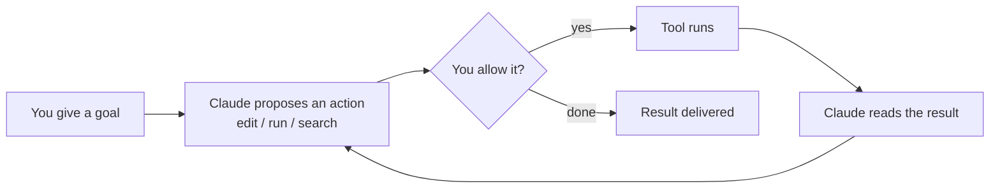

<LevelBadge level="beginner" />

<VerifyNote lastVerified="2026-06-20" source="https://code.claude.com/docs/en/overview">
安装命令和具体的功能集经常变化。请将 Claude Code 官方文档视为安装配置的权威来源。
</VerifyNote>

**Claude Code** 是 Anthropic 推出的*智能体式*编程工具。与聊天窗口不同，它能真正在你的项目里**做事**：读写文件、运行 shell 命令、搜索代码库、调用外部工具——而这一切都需经过你的许可。

## 心智模型：智能体循环

这是让其他一切都讲得通的核心理念：

你用自然语言给出一个目标（"给 auth 模块加测试，并修复失败项"）。Claude 会**规划、执行、观察结果，然后重复**，直到达成目标。你通过[权限](/docs/claude-code)和[规划模式](/docs/claude-code)始终掌控全局。

## 你可以在哪里运行它

- **终端（CLI）**——最初的形态；可在任何 shell 中使用。
- **IDE 扩展**——VS Code 和 JetBrains，支持内联 diff。
- **桌面端与网页端**——并且它会在各个端之间共享你的设置、钩子和权限。

## 你将配置哪些内容（大致按收益高低排序）

1. **[CLAUDE.md](/docs/claude-code)**——持久化的项目指令。收益最高，投入最低。
2. **[规划模式](/docs/claude-code)**——在任何编辑执行*之前*先调查并提出方案。
3. **[权限](/docs/claude-code)**——Claude 无需询问即可执行的操作。
4. **[settings.json](/docs/claude-code)**——完整的配置系统。
5. **[斜杠命令](/docs/claude-code)**、**[钩子](/docs/claude-code)**、**[技能](/docs/claude-code)**、**[子智能体](/docs/claude-code)**、**[MCP 服务器](/docs/claude-code)**——高阶功能，按需逐层叠加。

## 你的第一次会话（大致流程）

1. 安装并完成身份认证（当前命令见[官方文档](https://code.claude.com/docs/en/overview)）。
2. `cd` 进入某个项目并启动 Claude Code。
3. 运行 `/init` 生成一份初始的 **CLAUDE.md**。
4. 提一个小而具体的请求：*"解释这个应用里路由是怎么工作的。"*
5. 然后先在**规划模式**下尝试做一次改动，审阅方案，再让它执行。

:::tip 从只读开始
做第一个真实任务时，请使用[规划模式](/docs/claude-code)——Claude 会进行调查并向你展示方案，而不会触碰文件。这是建立信任最安全的方式。
:::

## 下一步

- 收益最高的配置 → [CLAUDE.md 与记忆文件](/docs/claude-code)
- 端到端实操 → [实战演练：为真实仓库定制 Claude Code](/docs/walkthroughs)
- 构建你自己的自动化 → [模板与配方](/docs/templates)
