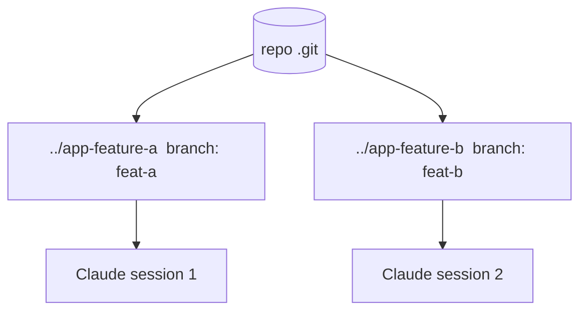

<LevelBadge level="advanced" />

**git worktree** 让一个仓库可以拥有**多个工作目录**，每个目录检出到不同的分支。把它和 Claude Code 结合，你就能在同一个项目上**并行运行多个会话**——每个会话编辑自己的文件，互不冲突。

## 它解决的问题

如果两个 Claude 会话同时编辑同一个工作目录，它们会互相干扰对方的改动。worktree 给每个会话**各自的目录和分支**，从而让并行工作保持隔离，直到你合并为止。



## 基础用法

```bash
# from your repo
git worktree add ../app-feature-a -b feat-a   # new dir + new branch
git worktree add ../app-fix-123 -b fix-123
git worktree list
# when done with one:
git worktree remove ../app-feature-a
```

在每个 worktree 目录里各开一个 Claude Code 会话，让它们独立工作。

## 什么时候值得用

- **想同时推进的并行功能/修复**。
- **一个长任务正在运行**于某个 worktree，而你在另一个里继续工作。
- **有风险的实验**，与你的主检出隔离开来。

## 陷阱

:::warning 留意合并回归
- 分支最终都要**合并**——冲突会在那时出现，而非过程中。让 worktree 保持聚焦、短命。
- 不要从两个 worktree 同时运行**有状态的共享资源**（同一个开发数据库、同一个端口），除非你把它们分开。
- 用 `git worktree remove` 清理，避免残留目录越积越多。
:::

## Worktree 对比子智能体

- **[子智能体](/docs/claude-code/subagents)** = *单个会话内部*的并行（委派、隔离上下文）。
- **Worktree** = 磁盘上*跨会话*的并行（隔离的分支/文件）。二者可以很好地组合：worktree 里的会话本身还可以派生子智能体。

## 下一步

- [子智能体与并行智能体](/docs/claude-code/subagents)
- [无头模式与 Agent SDK](/docs/claude-code/headless-and-agent-sdk)
- [上下文管理](/docs/claude-code/context-management)
