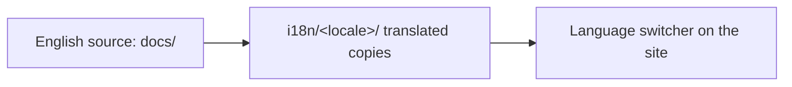

<LevelBadge level="intermediate" />

AILmanac 以英文为先，但**生来就是为翻译而设计的**——这正是它能触及“世界上每一个人”的方式。如果你愿意把它带到你的语言，下面就是路径。

## i18n 在这里如何运作

站点使用 Docusaurus 内置的国际化能力。**英文是规范的源头。** 一种语言就是一套并行的、已翻译的文件；一旦某种语言被启用，Docusaurus 就会提供语言切换器。

## 黄金法则：先认领，再上线

:::warning 生产环境不接受半成品翻译
一种语言只有在**有人承诺维护它之后才会在生产环境启用。** 一个翻译进度 30%、陈旧数月的语言，对公信力的伤害比根本没有翻译还大。把*一个完整章节*翻译好，胜过零散地翻一些不完整的页面。
:::

## 如何贡献一份翻译

1. **开一个 issue**（使用 *translation* 模板），说明你将负责哪种语言、哪个章节。
2. **先翻译一个连贯的整块**——例如整个 *Start Here*——而不是随机挑选页面。
3. **保持代码、命令和 `VerifyNote` 来源不变**；翻译正文、标题和警示框文字。
4. **不要翻译模型 ID 或链接**；保持 `/docs/...` 路径原样。
5. **发起一个 PR。** 由维护者审阅；当某种语言有了负责人 + 一个完整的首个章节后，我们就会启用它。

## 小贴士

- **用 Claude 起草**，再由流利的人类审校——AI 翻译是很好的初稿，而非最终权威（[幻觉](/docs/foundations/hallucinations)同样适用于翻译）。
- **匹配英文页面的级别/语气。**
- **标出无法翻译的术语**（在你所在语言的技术社区惯用英文时，保留 “prompt”、“token” 等词）。

## 下一步

- [十分钟参与贡献](/docs/contribute/contribute-in-10-minutes)
- [内容风格指南](/docs/contribute/style-guide)
- [行为准则与治理](/docs/contribute/governance)
