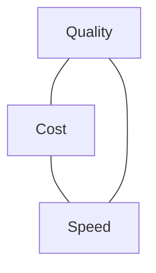

<LevelBadge level="intermediate" />

质量、成本和速度彼此牵制。你无法同时把三者都拉满——但你*可以*把每一项花在最重要的地方，在其他地方处处节省。

## 三角

更大的模型更聪明，但更慢、更贵；更小的模型快又便宜，但能力更弱。好的工程就是**把每个任务路由到这个三角上正确的那个点**。

## 最大的杠杆（大致按顺序）

1. **为模型选对尺寸。** 别用 Opus 去做分类。从 Sonnet 开始，对简单/高并发的步骤降到 Haiku，把 Opus 留给最难的部分——[选择模型](/docs/api/choosing-a-model)。
2. **模型分级 / 级联。** 先用便宜的模型；仅在需要时（例如置信度低的情况）才升级到更强的模型。
3. **[提示词缓存](/docs/api/prompt-caching)。** 在多次调用间复用稳定的提示词前缀——对重复的系统提示、RAG 上下文或智能体工具目录能省下大量成本。
4. **削减输入 token。** 只发送重要的内容；[RAG](/docs/foundations/rag) 优于把整个知识库塞进去。更短的输入 = 更便宜，*而且*往往更好。
5. **限制输出**——用合理的 `max_tokens` 和严格的格式指令。
6. **批处理**那些延迟无关紧要的离线工作。

## 专门针对延迟的优化

- **流式传输**响应，让用户立即看到输出——即使总时间不变，也能极大提升*感知*速度（[流式传输](/docs/api/streaming)）。
- **并行化**相互独立的子调用。
- **缓存**重复的工作；能预计算的就预计算。
- 为交互路径挑一个**更小的模型**；把繁重的工作放到异步去做。

## 别盲目优化

先测量：token 和秒数实际上花在哪里？然后优化最大的那一项。任何成本削减之后，都要用 [评估](/docs/foundations/evals) 重新核查质量——一个出错的更便宜方案并不更便宜。

## 下一步

- [选择 Claude 模型](/docs/api/choosing-a-model)
- [提示词缓存与成本优化](/docs/api/prompt-caching)
- [Token、上下文与定价](/docs/api/tokens-and-pricing)
