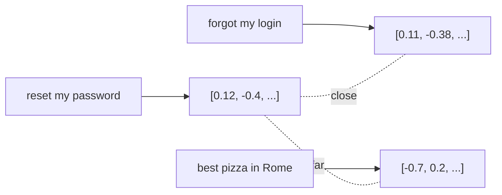

<LevelBadge level="intermediate" />

**嵌入（embedding）**把一段文本转化为一串数字（一个**向量**），用以捕捉它的*含义*。含义相近的文本会得到彼此靠近的向量——即使它们没有任何相同的词。这正是 **语义检索** 和 [RAG](/docs/foundations/rag) 背后的诀窍。

## 直觉

想象每个句子都被放置为一个巨大多维空间中的一个点，其排布方式使得**含义相近的点彼此靠近**。"我怎么重置密码？"会落在"我忘了登录信息"附近，离"罗马最好的披萨"很远。

## 语义检索 vs 关键词检索

- **关键词检索**匹配字面上的词（"password" 找到 "password"）。
- **语义检索**匹配*含义*——"我登录不了"能找到密码重置文档，即使其中没有 "password" 这个词。

最佳效果往往来自**结合**两者（混合检索）。

## 向量检索如何运作

1. **嵌入**你的文档（通常先切分成**块**）并把向量存入**向量数据库**。
2. 查询时，**嵌入查询**。
3. 找出**最近**的那些向量（按余弦相似度 / 距离）。
4. 返回这些块——通常用于喂给 [RAG](/docs/foundations/rag)。

## 实用提示

- **切分很关键。** 太大 = 匹配噪声多；太小 = 丢失上下文。要调优。
- **始终使用同一个嵌入模型**——来自不同模型的向量不可比较。
- **元数据 + 过滤器**（日期、来源、类型）能让检索精确得多。
- 并非总需要向量数据库——对小语料库，简单的内存检索就够了。

## 下一步

- [检索增强生成（RAG）](/docs/foundations/rag)
- [微调 vs 提示 vs RAG](/docs/foundations/finetune-vs-prompt-vs-rag)
- [幻觉及其减少方法](/docs/foundations/hallucinations)
