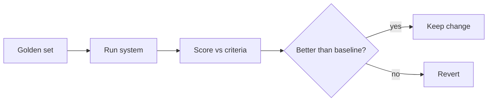

<LevelBadge level="advanced" />

如果你要交付任何基于 AI 构建的东西，**评估（evals）**就是你判断它是否有效的方式——也是你判断某个改动让它变好而非变坏的方式。没有评估，你就是在盲飞：一个对某个用例有帮助的提示词微调，可能悄无声息地破坏另外十个用例。

## 最小可行评估

你无需框架就能开始：

1. **收集黄金数据集。** 20–100 条真实输入，附上*正确*或*可接受*的输出（或清晰的判定标准）。覆盖简单用例、棘手用例，以及曾经坑过你的边界用例。
2. **定义每个任务中"好"的含义**——完全匹配、包含关键事实、符合 JSON 模式、无凭空捏造的数字、语气，等等。
3. **运行并打分**：用当前方案跑这个数据集。
4. **每次只改一处**（提示词、模型、检索），重跑，**比较**。只有当分数提升时才保留改动。

## 选择指标

- **尽可能用确定性检查**：模式是否合法？是否包含正确的值？代码是否通过测试？这些既便宜又可信。
- **用 LLM 作为评判**来评估模糊的质量（有用性、语气）：让一个模型按评分细则给输出打分。有用，但要**校准它**——评判模型有偏差（长度偏好、位置偏好）。在一个样本上用人工评分来验证评判模型。
- 对最高风险的那一部分采用**人工审查**。

## 何时运行

- **在任何提示词或模型改动之前/之后。**
- **在模型迁移时**——新模型可能改变行为（[错误处理与迁移](/docs/api/errors-and-rate-limits)）。
- **在 CI 中**作为生产系统的关卡。

:::tip 分阶段评估
对 [RAG](/docs/foundations/rag) 和 [智能体](/docs/api/building-agents)，请评估每个阶段（检索是否找到了正确的文档？工具是否被正确调用？）——而不仅仅是最终答案。这能把失败定位出来。
:::

## 下一步

- [幻觉及其减少方法](/docs/foundations/hallucinations)
- [在 API 上构建智能体](/docs/api/building-agents)
- [选择模型与提供商](/docs/foundations/choosing-a-model-provider)
