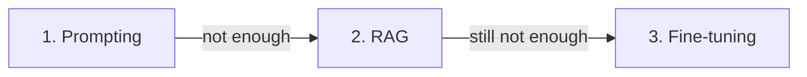

<LevelBadge level="intermediate" />

当模型没有按你的期望去做时，有三个杠杆可用——而人们往往先去够最贵的那一个。下面是真正有效的顺序。

## 按此顺序尝试

### 1. 提示——永远从这里开始
更清晰的指令、示例、角色、输出约束（[提示工程基础](/docs/prompting/basics)）。它能修复**绝大多数**问题，不产生额外成本，而且迭代起来即时。大多数"模型在 X 上很差"最后都被证明是"提示词太含糊"。

### 2. RAG——当它需要*你的*知识时
如果差距在于**缺失或时新的信息**（你的文档、你的数据、当前事实），那就加上 [RAG](/docs/foundations/rag)。它让知识保持可更新、可引用，而无需触碰模型。

### 3. 微调——最后手段，用于规模化的*行为/格式*
微调会在你的示例上对模型进行进一步训练。只有当提示 + RAG 都无法获得一致的**风格、格式或任务行为**，且你拥有**大量高质量示例**以及足以证明其合理性的用量时，才动用它。

## 决策表

| 你的问题 | 应选用 |
|---|---|
| 输出含糊/错误、格式不对 | **提示** |
| 不了解你的数据 / 需要当前信息 | **RAG** |
| 需要非常特定的风格/行为，并要一致、规模化 | **微调** |
| 需要执行操作 | （都不是——那属于 [工具使用/智能体](/docs/api/tool-use)） |

## 人们为何会弄错

微调*听起来*像是"教会模型"，所以感觉它才是真正的解决办法。但它是最慢、最贵、最不灵活的选项，它**并不擅长补充时新的知识**（那是 RAG 的活），而且很容易做砸。先把提示和 RAG 用尽——你通常根本用不到第 3 步。

:::tip 它们可以组合
一个强大的系统往往是一个好**提示** + 用于知识的 **RAG**，并把微调保留给某个狭窄的行为需求。它们并不互斥。
:::

## 下一步

- [检索增强生成（RAG）](/docs/foundations/rag)
- [提示工程基础](/docs/prompting/basics)
- [评估 AI 质量（Evals）](/docs/foundations/evals)
