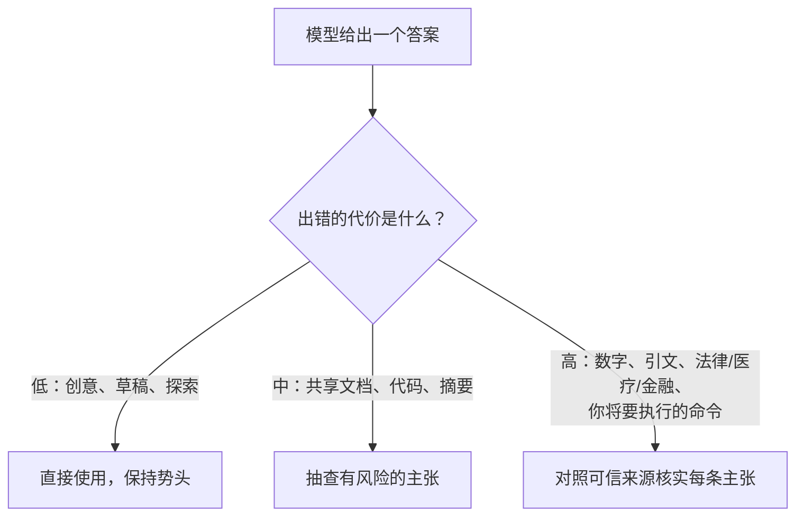

<LevelBadge level="intermediate" />

**幻觉（hallucination）**指模型以十足的自信陈述某个错误的内容。它不是在撒谎，也不是坏了——这是 LLM 工作方式的另一面：它们生成*看似合理*的文本，而看似合理并不总是真的（参见 [什么是 LLM？](/docs/foundations/what-is-an-llm)）。你无法靠提示词把它完全消除，但你可以大幅减少它，并把剩下的揪出来。

## 它为什么会发生

模型预测一个可能的续写。当它"不知道"某件事时，*看起来最可能的*续写往往是一个自信、措辞完整——却错误的——答案。除非你给它留出空间，否则没有内建的"我不确定"信号。

## 高风险区域

当输出涉及以下内容时，最应保持怀疑：

- **引文、引述与参考文献**——捏造的论文、伪造的 URL、错误归属的引述。
- **具体的数字、日期与统计数据**——看似合理却虚构的数字。
- **冷门或非常近期的事实**——超出模型可靠学到的范围。
- **API 与库的细节**——不存在的方法或参数。
- **人物及法律/医疗细节**——风险高，且容易出现微妙的错误。

## 减少幻觉的工具箱

把这些叠加起来——每一项都有帮助：

1. **把它锚定在来源上。** 粘贴源文本并说*"只根据上面的文本回答；如果文本里没有，就说没有。"*这正是 [RAG](/docs/foundations/rag) 背后的核心思想。
2. **给它一个台阶。** 明确允许*"如果你不确定，就说'我不知道'"*——这能极大减少自信的瞎猜。
3. **要求推理与引用。** *"引用支持每条主张的那一句原话。"*没有依据的主张就会一目了然。
4. **降低创造性**——对于模型暴露温度控制的事实类任务（参见 [采样控制](/docs/foundations/sampling-controls)）。
5. **使用工具。** 对于数学、当前数据或查询，给模型一个计算器/搜索/[工具](/docs/api/tool-use)，而不是相信它的记忆。
6. **交叉核对。** 用两种方式问同一个问题，或让第二轮去评判第一轮。

## 一段可复制粘贴的反幻觉提示词

上面工具箱里的大部分内容都可以浓缩成一个可复用的封装。把你的来源粘贴到指定位置并提出问题——它会把答案锚定在来源上、给模型一个台阶，并一次性强制要求给出引用：

```text
你只能根据下面的 SOURCE 来回答。
规则：
- 如果答案不在 SOURCE 中，请精确回复："来源中未提及。"
- 在每条主张之后，引用 SOURCE 中支持该主张的确切句子。
- 不要添加外部知识、估算或假设。

SOURCE:
"""
[在此粘贴文档、转录文本或数据]
"""

QUESTION: [你的问题]
```

它为什么有效："来源中未提及"这个逃生出口消除了瞎猜的压力，而"引用句子"的规则让任何没有依据的主张都无处藏身。当你确实想要模型自身的知识时，就去掉 SOURCE 块——但那样核实的责任就重新落回你身上。

## 真正能保护你的心态

:::warning 重要的内容——永远核实
没有任何提示词能让输出 100% 可靠。对于任何有后果的内容——报告里的一个数字、一条引文、一个你将要执行的命令、一项医疗/法律/金融细节——**都要对照可信来源去核对**。把 AI 当作快速的初稿，而非最终权威。这正是 [负责任地使用](/docs/security/responsible-use) 的核心。
:::

一条简单的规则：**出错的代价决定了核实的力度。** 头脑风暴？尽管信任。发布一项统计数据？每次都核实。



## 下一步

- [检索增强生成（RAG）](/docs/foundations/rag)
- [评估 AI 质量（Evals）](/docs/foundations/evals)
- [负责任地使用、伦理与核实](/docs/security/responsible-use)
