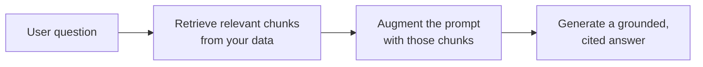

<LevelBadge level="intermediate" />

**RAG** 让模型回答关于**你的**数据的问题——文档、知识库、代码库——这些都是它从未训练过的。思路很简单：**检索（retrieve）**出相关片段，用它们**增强（augment）**提示词，然后**生成（generate）**一个基于这些片段的答案。

## 循环

1. **索引**你的数据：切分成块，对它们做 [嵌入](/docs/foundations/embeddings)，存入向量（和/或关键词）索引。
2. **检索**与问题最相关的前若干块。
3. **增强**：把这些块放进提示词，附上类似*"只根据下面的上下文回答；如果上下文里没有，就说没有。"*的指令。
4. **生成**——并最好**注明**每条主张来自哪一块。

## 为什么用 RAG 而非微调？

RAG 让知识保持**时新**（更新数据，而非模型）、提供**引用**，并且比重新训练便宜得多。对于大多数"回答关于我文档的问题"的需求，它是正确的首选工具——参见 [微调 vs 提示 vs RAG](/docs/foundations/finetune-vs-prompt-vs-rag)。

## 失败模式（RAG 质量在哪里崩掉）

- **检索差 = 答案差。** 如果正确的块没被检索出来，模型就无法使用它。大多数"RAG 答错了"的问题其实是*检索*问题。
- **切分太粗/太细**——会毁掉相关性（[嵌入](/docs/foundations/embeddings)）。
- **没有锚定指令**——模型会把检索到的事实和它自己的猜测混在一起。要告诉它*只*根据上下文回答，并坦承不足之处。
- **塞得太多**——无关的块会稀释信号并消耗 [token](/docs/foundations/tokens-and-context)。检索少量、高质量的块。
- **没有引用**——你无法核实，所以你无法信任。

:::tip 单独评估检索
把"我们是否检索到了正确的块？"与"模型是否答得好？"分开衡量。这能快速定位问题。参见 [评估](/docs/foundations/evals)。
:::

## 下一步

- [嵌入与向量检索](/docs/foundations/embeddings)
- [微调 vs 提示 vs RAG](/docs/foundations/finetune-vs-prompt-vs-rag)
- [研究与综合实战手册](/docs/playbooks/research)
