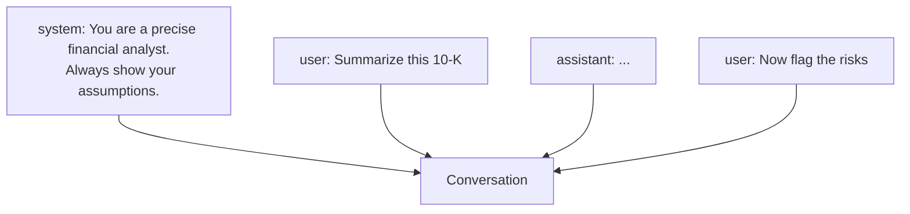

<LevelBadge level="beginner" />

每一次 AI 对话都由**消息（messages）**构成，而每条消息都有一个**角色（role）**。理解这三个角色，就能明白如何引导模型——以及为什么有些指令能生效、有些却不行。

## 三个角色

- **System（系统）**——面向整段对话的顶层设定：模型应该是谁、规则、格式。设定一次，全程适用。
- **User（用户）**——也就是你：你逐轮的提问与输入。
- **Assistant（助手）**——模型的回复。（你也可以*替助手"代言"*作为示例——参见 [少样本](/docs/prompting/few-shot)。）

## 为什么系统提示是你最强大的杠杆

系统消息为**之后的一切**定下框架。这里是你设定模型角色、标准、语气和硬性规则的地方——而模型会给它很高的权重。如果你想在整段对话（或整个应用）里获得一致的行为，就把它放在这里，而不是埋在某个用户轮次中。

实践中：
- **聊天应用：** 你账户的 [自定义指令](/docs/claude-app/custom-instructions) 充当个人的系统提示。
- **Claude Code：** [CLAUDE.md](/docs/claude-code/claude-md) 为你的项目扮演这个角色。
- **API：** [`system` 参数](/docs/api/first-call)。

同一个思路，三种载体。

## 实用提示

- **在系统提示里把角色、规则和输出格式说具体**——这是做这件事杠杆最高的地方。
- **让用户轮次聚焦**在实际任务上；别每一轮都重新粘贴规则。
- **指令冲突了？** 一条靠后、明确的用户指令可以覆盖一条含糊的系统指令——保持一致以避免意外（[故障排查](/docs/contribute/troubleshooting)）。

## 下一步

- [提示工程基础](/docs/prompting/basics)
- [自定义指令与风格](/docs/claude-app/custom-instructions)
- [Token、上下文与记忆](/docs/foundations/tokens-and-context)
