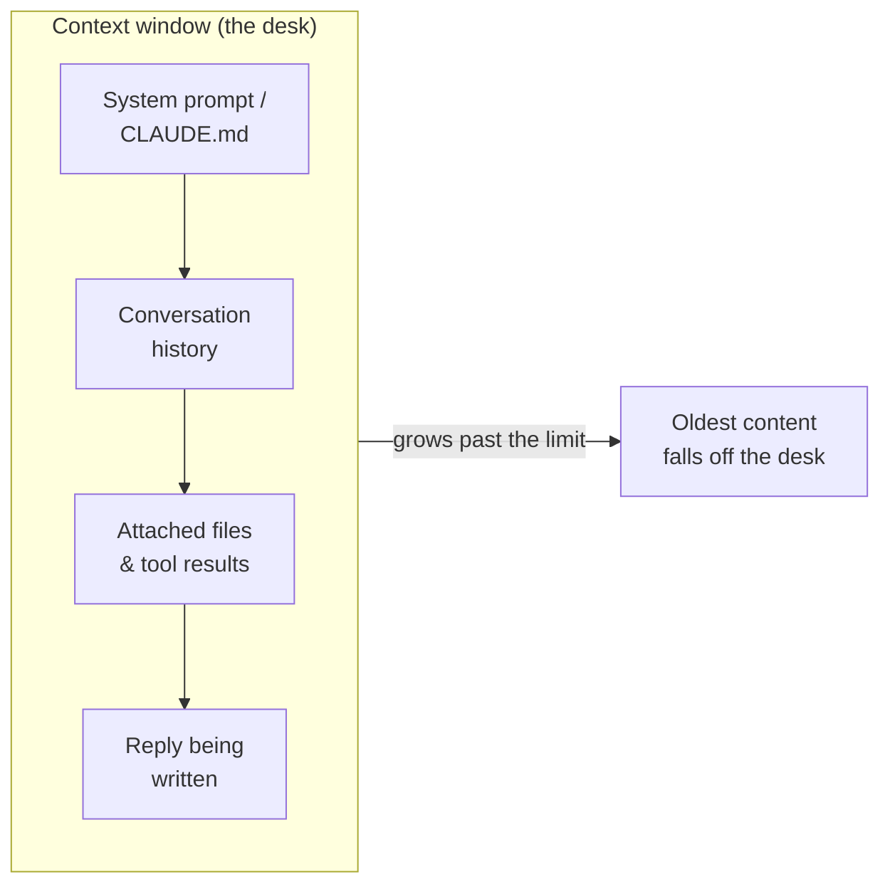

<LevelBadge level="beginner" />

三个概念能解开许多"它为什么会这么做？"的疑惑：**token**、**上下文窗口**以及**记忆**。理解了这些，你就不会再为偏离、遗忘和意外账单而感到惊讶了。

<Callout
  type="objectives"
  items={[
    "像模型一样读取文本——以 token 为单位，而不是单词或字符",
    "把上下文窗口想象成一张有限的桌面，并预测什么时候内容会掉下去",
    "识别'上下文腐烂'——为什么模型会丢失长输入中间的内容",
    "了解'记忆'的四个真正来源，以及如何有意识地提供它"
  ]}
/>

## Token：模型思考的单位

模型不读取字符或单词——它们读取 **token**，也就是文本块，在英语中大约相当于一个单词的 ¾。"Unbelievable"可能是 3–4 个 token；常见单词各占一个；一个空格、一个逗号或一段代码也都要消耗 token。你的输入*以及*模型的输出都会被计入，而 token 正是[定价与限制](/docs/api/tokens-and-pricing)所衡量的对象。

你不需要手动去数，但有个大致的感觉会有帮助：**约 750 个英文单词 ≈ 约 1,000 个 token**。输入一些内容看看：

<TokenEstimator />

:::tip 为什么这个比例会变化
普通英语接近每 token ¾ 个单词。代码、JSON、非拉丁文字、长 URL 和生僻词会被拆分成*更多*的 token——所以一个 500 行的文件或一段中文段落消耗的 token 比其字数所暗示的要多。当账单或限制让你意外时，通常就是这个原因。
:::

## 上下文窗口：工作记忆

**上下文窗口**是模型一次能够考虑的最大 token 数——*你的系统提示、到目前为止的整段对话、所有附加的文件，以及它正在撰写的回复，*全部加在一起。把它想象成模型的桌面：很大，但有限。窗口大小因模型而异，并且在不断增长——请查看[模型与定价](/docs/whats-new/models-and-pricing)了解当前数字，而不是去记住某一个。

模型此刻所"知道"的一切都摆在那张桌面上：

当对话增长超过窗口时，**最旧的内容会掉下去**。这就是为什么一段很长的聊天似乎会"忘记"它是怎么开始的，或者偏离你最初的指令。

## 上下文腐烂：不只是*满*与*空*的问题

还有一个更微妙的问题：即使所有内容仍然装得下，模型也倾向于比起**中间**更可靠地利用长输入的**开头和结尾**。把那唯一重要的一句话埋在 50 页粘贴内容的正中间，它可能会被低估权重——这种失效模式常被称为*"迷失在中间"*。

<VerifyNote lastVerified="2026-06-29" source="https://arxiv.org/abs/2307.03172">"迷失在中间"效应——对放在上下文中段的信息利用程度下降——由 Liu et al.（2023）记录。较新的长上下文模型对此处理得更好，但下面这个实用习惯仍然值得保持。</VerifyNote>

<Steps
  items={[
    {title: "把请求放在最前面", body: "把真正的指令或问题放在前面，在粘贴长文档之前——而不是埋在它后面。"},
    {title: "在结尾重述", body: "在长内容之后用一行重复关键指令。开头 + 结尾的位置是最强的。"},
    {title: "粘贴前先精简", body: "删掉无关的部分。中间的噪声越少，留下来的信号就能获得更多关注。"},
    {title: "内容庞大时拆分", body: "对于非常大的输入，先总结或分块，而不是把所有东西一股脑倒进去——或者为一个新的子任务开启一段全新的聊天。"}
  ]}
/>

下面是同一个请求，经过组织后让指令位于强势位置：

<PromptCard title="指令在前，结尾重述">{`任务：找出这份合同中所有限制我方责任上限的地方，并引用确切的条款。

[... 在此粘贴完整的 40 页合同 ...]

任务提醒：仅列出责任上限条款，附上确切引用和章节编号。忽略其他一切内容。`}</PromptCard>

:::tip 在 Claude Code 中
长时间的智能体会话会撞上同样的天花板。Claude Code 会有意地管理它——压缩历史记录，并让你掌控哪些内容留在视野之内。请参阅[上下文管理](/docs/claude-code/context-management)和[上下文工程](/docs/frontiers/context-engineering)。
:::

## 记忆：默认情况下并不存在，除非你提供它

默认情况下，每段对话都是一张**白纸**。模型不记得你上一次的聊天。一切看起来像记忆的东西，无非是以下四种之一：

| 来源 | 它是什么 | 你如何控制它 |
| --- | --- | --- |
| **重新发送的历史记录** | 聊天应用每一轮都重新发送对话，直到窗口被填满 | 开启全新的聊天；保持话题专注 |
| **记忆功能** | 某些 Claude 界面会跨聊天携带事实 | [跨聊天记忆](/docs/claude-app/memory)设置 |
| **你提供的文件** | 你有意附加的持久上下文 | [项目](/docs/claude-app/projects)、[CLAUDE.md](/docs/claude-code/claude-md) |
| **你自己的代码** | API 是**无状态的**——你需要重新发送之前的消息 | [第一次 API 调用](/docs/api/first-call) |

贯穿始终的道理：*如果你想让模型记住某件事，你就得不断地把它放回桌面上。*

## 为什么这很重要

几乎每一个"它忽略了我之前的指令"或"它跟丢了"的问题，都可以追溯到三件事之一：窗口被填满了、一段新会话从零开始，或者关键细节埋在了一段长粘贴内容的死寂中段。明白了这一点，你就会去组织你的提示和会话，让重要的内容始终*保持在视野之内*。

## 自我检测

<Quiz
  questions={[
    {
      q: "750 个普通英文单词大约是多少个 token？",
      options: ["约 250", "约 1,000", "约 3,000", "正好 750"],
      answer: 1,
      explain: "一个好用的经验法则是：对普通英语而言，约 750 个单词 ≈ 约 1,000 个 token。代码和非拉丁文字会更高。"
    },
    {
      q: "一段长聊天开始'忘记'它是怎么开始的。最可能的原因是：",
      options: [
        "模型坏了",
        "随着对话增长，最早的内容掉出了上下文窗口",
        "模型永久学会了你之前的消息",
        "token 被退还了"
      ],
      answer: 1,
      explain: "上下文窗口是有限的。当对话超出它时，最旧的 token 会从'桌面'上掉下去——所以早期的指令可能会从视野中消失。"
    },
    {
      q: "你必须粘贴一份庞大的文档外加一条关键指令。最佳的放置方式？",
      options: [
        "指令只放在文档的正中间",
        "指令放在最开头，并在结尾重述",
        "不放指令——让模型去猜",
        "把指令放在一段模型看不到的单独聊天里"
      ],
      answer: 1,
      explain: "模型最可靠地利用长输入的开头和结尾（'迷失在中间'）。把请求放在前面，并在结尾重述。"
    }
  ]}
/>

## 关键术语

<Flashcards
  title="牢记词汇"
  cards={[
    {front: "Token", back: "模型实际处理的文本块——大约相当于一个英文单词的 ¾。输入和输出都会被计入，而且定价是按 token 计算的。"},
    {front: "上下文窗口", back: "模型一次能考虑的最大 token 数：系统提示 + 历史记录 + 文件 + 回复，全部加在一起。有限——超出限制的内容会掉下去。"},
    {front: "迷失在中间", back: "比起中间，更可靠地利用长输入开头和结尾的倾向。把关键指令放在强势位置。"},
    {front: "无状态性", back: "API 在两次调用之间什么都不记得。要继续一段对话，你需要自己重新发送之前的消息。"}
  ]}
/>

:::note 要点
- **Token** 既是思考的单位，也是计费的单位——每 750 个英文单词约 1,000 个，代码和其他文字会更多。
- **上下文窗口**是一张有限的桌面；长聊天之所以会忘记，是因为旧内容掉下去了。
- 即便在窗口之内，也要**把你的指令放在前面，并在结尾重述**——中间会被利用不足。
- **默认情况下没有记忆**。要有意地提供它：用文件、项目、CLAUDE.md，或者通过重新发送历史记录。
:::

## 下一步

- [什么是 LLM？](/docs/foundations/what-is-an-llm)
- [系统、用户与助手角色](/docs/foundations/roles)
- [上下文工程](/docs/frontiers/context-engineering)
- [Token、上下文与定价（API）](/docs/api/tokens-and-pricing)
