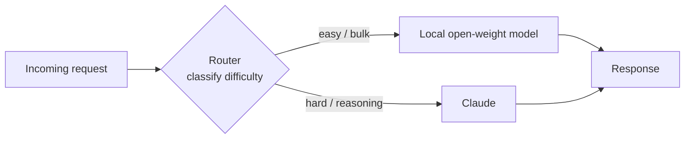

<LevelBadge level="advanced" />

“前沿模型**还是**本地模型”这种框定是一个伪命题。在生产环境中最具成本效益、最尊重隐私、也最有韧性的系统同时使用**两者**——用一个在本地运行的小型开放权重模型处理简单、高频或敏感的工作，用像 Claude 这样的前沿模型作为处理艰难推理的**智能层**。本页讲的是把两者串联起来、让各自做最擅长之事的那些持久*模式*。这些模式与厂商无关——Claude 只是非常适合担当“推理”角色——而且它们比任何具体的模型名称都更长久。

<Callout type="objectives" items={[
  "理解为什么混合方案（前沿 + 本地）在成本、隐私和韧性上都胜过单独使用任一模型",
  "掌握五种持久的混合模式：路由/大小核、先草稿后精修、隐私脱敏、批量预处理/后处理，以及离线回退",
  "对每种模式：知道何时该用它、你所接受的权衡，以及一个具体的示意方案",
  "用一套可复用的四步方法，设计属于你自己的 Claude+本地 混合方案",
  "明白这些模式与厂商无关——Claude 是嵌入进来的“智能层”，而非一种锁定",
]} />

## 为什么要混合，而非二选一

本地开放权重模型（见 [用 Ollama 在本地运行模型](/docs/models/run-models-locally-ollama)）和前沿模型各自擅长*不同*的事情：

- **本地模型**是私密的（数据永不离开你的机器）、大规模下便宜（没有按 token 计费）、对小模型而言低延迟，而且能离线工作。但它在最艰难的推理、长上下文和智能体任务上存在真实的**能力差距**。
- **Claude（前沿模型）**恰恰在这些艰难任务上领先，但每次调用都要消耗 token，并把数据发送到云端 API。

下面每种模式背后的洞见都是：**大多数请求都很简单，艰难的只是少数。**如果一个便宜的本地模型能处理大头，而你把前沿模型保留给真正艰难的那一小片，你就能以极小的成本换取大部分的前沿质量——同时还能把敏感数据留在本地。微软的 *Hybrid LLM* 论文将此形式化了：一个把简单查询发给小模型的学习型路由器，对大模型的调用**最多减少了 40%**，而响应质量毫无下降（[arXiv 2404.14618](https://arxiv.org/abs/2404.14618)）。开源框架 [RouteLLM](https://github.com/lm-sys/RouteLLM) 报告了类似结果——在常见基准上，通过把大约一半的查询路由到更便宜的模型，以大约**一半的成本**换取接近前沿的质量。

> 用**约束**来选择你的混合方案，而不是用炒作。如果你还不知道哪个模型适合哪种任务，先从 [选择模型](/docs/models/choosing-a-model) 开始——然后回到这里，决定本地与前沿之间*边界该落在哪里*。

---

## 模式 1 — 路由 / 大小核

**核心思路。**在每个请求前面放一个轻量的**分类器**。它审视任务并做出判断：简单/批量 → 本地模型；艰难推理 → Claude。这借鉴自“big.LITTLE”CPU 设计——手机在小巧高效的核心上跑后台工作，只在重负载时才唤醒大核心。

**何时使用。**你有一股混合的请求流——许多微不足道，少数真正艰难——而你只想为艰难的那些支付前沿价格。这是最主力的混合方案。

**权衡取舍。**路由器可能*判断错误*。把艰难任务误路由到本地模型，质量就会下降；把简单任务误路由到 Claude，你就多花了钱。你通过调节一个阈值来在成本与质量之间权衡，而且你应当用一个小型评测在你自己的数据上**测量**这个阈值（见 [评测](/docs/power-user/evals)）。

**示意方案。**路由器可以简单到只是一层规则（长度、关键词、是否含代码），也可以丰富到是一个小型分类模型。一个便宜且透明的选项是，让**本地**模型自己给难度分类，然后据此分派：

<PromptCard title="路由分类提示词（在本地模型上运行）">{`You are a request router. Classify the user request into exactly one tier.

Return ONLY a JSON object: {"tier": "...", "reason": "..."}

Tiers:
- "local"  → simple, mechanical, or high-volume: short rewrites, formatting,
             single-fact lookup, basic classification/extraction, boilerplate.
- "frontier" → hard reasoning, multi-step planning, long-context synthesis,
             ambiguous instructions, code that must be correct, anything where
             a wrong answer is costly.

Bias toward "local" when in doubt about a CHEAP, low-risk task,
and toward "frontier" when a mistake would be EXPENSIVE.

Request:
"""
{{REQUEST}}
"""`}</PromptCard>

路由器的输出是一个路由决策，而非最终答案——要让它保持小巧且快速。若要在众多工具或模型之间做更丰富的路由，同样的“先分类再分派”逻辑可以推广（并且很像模型如何在[工具](/docs/api/tool-use)之间做选择）。

---

## 模式 2 — 先草稿后精修

**核心思路。**本地模型产出一份**便宜的初稿**；Claude 对它进行**润色、纠错或验证**。你为精修支付前沿 token，而不是从头生成——而一份好的草稿会让 Claude 的活儿更短、更可靠。

**何时使用。**开放式生成场景，其中一份粗略草稿比一份完美草稿便宜得多，但最终输出必须高质量：长篇写作、代码、结构化文档、必须完全正确的摘要。

**权衡取舍。**两次模型调用而非一次会增加延迟，而一份*糟糕的*草稿可能把精修者锚定到它的错误上。当起草是昂贵的部分、而精修相对便宜时，收益才会显现——请在你的数据上验证“本地起草 + 前沿精修”在“每份可接受输出的成本”上是否真的胜过“前沿一手包办”。

**示意方案。**本地模型起草 → 把草稿连同一条聚焦的指令交给 Claude：*“这是一份草稿。修正错误、精炼、并核验论断；返回修正后的版本。”*这与在 token 层面驱动**推测解码**的直觉相同——小型起草者提议，大模型验证并只保留经得起检验的部分（[NVIDIA：推测解码](https://developer.nvidia.com/blog/an-introduction-to-speculative-decoding-for-reducing-latency-in-ai-inference/)）。在任务层面你是在手动做同样的事：便宜地提议，昂贵地验证。

---

## 模式 3 — 隐私脱敏

**核心思路。**在任何内容被发送到云端 API *之前*，由一个本地模型（或本地 NLP 工具链）**剥离 PII**。Claude 在脱敏后的版本上做推理；如有需要，你在返回途中于本地把真实值重新插回。

**何时使用。**你想要前沿推理，但你处理的是受监管或敏感的数据（健康、金融、客户记录），且原始 PII **绝不能**离开你的环境。脱敏让你能对问题的*形态*使用云端模型，而不暴露其中的人。

**权衡取舍。**脱敏永远不完美——漏掉一个实体就是一次泄露，而过度脱敏会摧毁模型回答所需的上下文。把脱敏器当作一项安全控制来对待：测试它的召回率，并把还原映射严格保留在本地。

**示意方案。**在输入上运行一个本地检测器/匿名化器，用占位符（`[PERSON_1]`、`[EMAIL_1]`）替换实体，把脱敏后的文本发给 Claude，然后在本地把占位符重新还原。微软的开源 [Presidio](https://github.com/microsoft/presidio) 是这里常见的构建模块——它检测并匿名化 PII，并且能使用可插拔的 NLP 后端，包括用一个本地模型对疑难情况做第二遍处理。一个关键且常被忽略的细节：对抵达模型的**所有内容**都要脱敏，包括检索到的文档和工具结果——而不仅是用户最新的那条消息。

---

## 模式 4 — 批量预处理/后处理

**核心思路。**本地模型处理**高频、重复**的工作——在成千上万个条目上做抽取、分类、打标、归一化——而 Claude 只处理本地模型标记为低置信度的**少数疑难情况**。

**何时使用。**流水线型工作负载：把 10 万条支持工单分类、从一大堆文档中抽取字段、给内容洪流打标。让每个条目都走一遍前沿 API 既慢又贵；而大多数条目都很简单。

**权衡取舍。**你需要一个可靠的**置信度 / 升级信号**，好让恰当的条目被升级处理。太激进你就多花钱；太保守则在艰难的长尾上质量受损。本地模型自报的置信度是一个起点，但要去验证它。

**示意方案。**本地模型处理整个批次并附上一个置信度分数；低于阈值（或未通过某个 schema/校验检查）的条目被升级到 Claude 来做艰难判断。这就是把模式 1 应用到批次而非实时请求上——同样是“便宜的处理大头，前沿的处理长尾”的经济学，也是级联所利用的，在简单的大多数上常能带来**40–70% 的成本节省**且质量损失极小。

---

## 模式 5 — 离线回退

**核心思路。**本地模型是**安全网**。当云端 API 宕机、被限流或不可达时，请求会*回退到*本地模型，而不是*彻底失败*。降级的答案胜过错误页面。

**何时使用。**任何可用性比始终最佳质量更重要的场景：必须持续工作的内部工具、端上功能、在厂商中断期间不能给用户展示硬错误的产品。

**权衡取舍。**按定义，回退响应**质量更低**——你是在用前沿的天花板换“仍然能用”。要让这种降级明确（给它加标签、收窄功能集），而不是悄悄地把更弱的答案当作真货来提供。

**示意方案。**把调用包进一条有序的链：先试 Claude → 遇到可用性错误（超时、429/5xx）时，带退避重试 → 若仍失败，路由到本地模型。像 LiteLLM 和 OpenRouter 这样的 LLM 网关恰恰实现了这种回退链模式，还包括对常见提示词的缓存，好让离线路径仍能提供些有用的东西。持久的原则是：**让一个本地模型作为你最后一道防线保持热态**，这样一次中断只会降级体验，而不会把它彻底打断。

---

## 设计属于你自己的 Claude+本地 混合方案

<Steps items={[
  {title: "绘制你的请求分布", body: "采样真实流量，标注有多大比例是真正艰难的、多大是简单/批量的、多大是敏感的。这个分布的形状会告诉你哪种模式划算——长长的简单尾巴偏向路由或批量预处理；一小片敏感数据偏向脱敏。"},
  {title: "选择与约束相匹配的模式", body: "混合的实时流量 → 模式 1（路由）。预算有限下的高质量生成 → 模式 2（先草稿后精修）。受监管/敏感数据 → 模式 3（脱敏）。流水线 / 批量体量 → 模式 4（批量）。可用性至关重要 → 模式 5（回退）。许多系统会组合其中两三种。"},
  {title: "设定边界，然后测量它", body: "决定本地在哪里止步、Claude 从哪里接手（一个路由阈值、一个置信度截断、一条脱敏策略）。在你自己的数据上跑一个小型评测，把成本与质量的权衡量化成数字。不要相信排行榜或厂商的头条数字——在你的任务上测量。参见“评测”页。"},
  {title: "加上可观测性和一个安全阀", body: "记录每一个路由/升级决策及其结果，好让你能随着模型与流量的变化重新调节边界。保留一个明确的回退（模式 5），让一次厂商中断优雅降级而非彻底崩溃。"},
]} />

<VerifyNote lastVerified="2026-06-28" source="https://docs.anthropic.com/en/docs/build-with-claude/models">
具体的模型名称、上下文窗口、按 token 计价和速率限制会频繁变化，本页有意**不**在此复述——它们是易变的部分。在你为路由器或级联固定一个成本或质量阈值之前，请到上述来源查看当前的 Claude 模型阵容与定价，并在 <a href="https://ollama.com/library">Ollama 库</a> 中查看当前的本地模型名称。本页上的模式是持久的；边界背后的确切数字则不是。
</VerifyNote>

<Quiz title="自我检查" questions={[
  {q: "让每一种混合模式都行得通的核心经济学洞见是什么？", options: ["本地模型总是比前沿模型更好", "大多数请求都很简单；只有少数才真正需要前沿推理", "前沿模型每 token 比本地模型更便宜"], answer: 1, explain: "真实流量的大头都很简单。如果一个便宜的本地模型处理简单的大多数，而你把前沿模型保留给艰难的少数，你就能以极小的成本换取大部分质量。这种不对称正是这里每一种模式所利用的。"},
  {q: "你必须用前沿模型对客户记录做推理，但原始 PII 不能离开你的环境。哪种模式合适？", options: ["路由 / 大小核", "隐私脱敏", "离线回退"], answer: 1, explain: "隐私脱敏在任何内容抵达云端 API 之前于本地剥离 PII，因此 Claude 是在脱敏后的版本上做推理，而真实值留在你的环境里。路由器决定把工作发往哪里；它并不移除敏感数据。"},
  {q: "路由 / 大小核模式特有的主要风险是什么？", options: ["它永远只能使用一个模型", "误路由的任务要么损失质量（把艰难的发给本地），要么浪费金钱（把简单的发给前沿）", "它要求云端 API 始终在线"], answer: 1, explain: "路由器是一个分类器，它可能出错。把艰难任务误路由到弱模型会损害质量；把简单任务误路由到前沿会浪费金钱。这正是为什么你要在自己的数据上调节并测量路由阈值。"},
  {q: "为什么先草稿后精修有时并不值得？", options: ["它产出的质量总是低于单次前沿调用", "两次调用增加延迟，而糟糕的本地草稿可能把精修者锚定到它的错误上", "前沿模型无法编辑不是自己写的文本"], answer: 1, explain: "先草稿后精修只有在起草是昂贵部分、精修便宜时才划算。两次模型调用增加延迟，而弱草稿可能把精修者带偏——所以要在你的数据上验证，本地起草 + 前沿精修是否真的胜过前沿一手包办。"},
]} />

<Flashcards title="五种混合模式一览" cards={[
  {front: "路由 / 大小核", back: "对每个请求分类，然后分派：简单/批量 → 本地，艰难推理 → Claude。最主力的混合方案。权衡：路由器可能误路由——在你自己的数据上调节阈值。"},
  {front: "先草稿后精修", back: "本地模型便宜地起草；Claude 润色/验证。为精修而非生成支付前沿 token。权衡：额外延迟，且糟糕的草稿可能锚定精修者。"},
  {front: "隐私脱敏", back: "一个本地模型/NLP 工具在任何内容抵达云端 API 之前剥离 PII；在本地还原。让你能在敏感数据上使用前沿推理。权衡：漏掉一个实体就是泄露；也要对工具结果和检索到的文档脱敏，而不仅是用户消息。"},
  {front: "批量预处理/后处理", back: "本地在整个批次上处理高频抽取/分类；Claude 只处理低置信度的升级情况。把模式 1 应用到批次。需要一个可靠的置信度/升级信号。"},
  {front: "离线回退", back: "本地模型是安全网：当云端 API 宕机或被限流时，回退到本地而非彻底失败。降级的答案胜过错误。要让这种降级明确。"},
]} />

<Callout type="takeaways" items={[
  "前沿 vs 本地是伪命题——最好的系统同时使用两者，用 Claude 作为与厂商无关的“智能层”来处理艰难的那一小部分工作",
  "全部五种模式都依托一个洞见：大多数请求既简单又便宜；把前沿开销保留给真正艰难的那一片",
  "路由/大小核是主力；先草稿后精修在预算内买到质量；脱敏解锁敏感数据；批量预处理扩展流水线；离线回退买来韧性——而且它们可以组合",
  "每种模式都有一个边界（一个阈值、一个置信度截断、一条脱敏策略）——用一个小型评测在你自己的数据上测量它，而绝不是靠排行榜",
  "把易变的数字（模型名称、价格、限制）藏在一个核验步骤之后；模式是持久的，具体数字则不是",
]} />

## 来源与延伸阅读

- [Hybrid LLM: Cost-Efficient and Quality-Aware Query Routing (arXiv 2404.14618, ICLR 2024)](https://arxiv.org/abs/2404.14618)
- [RouteLLM——用于服务和评估 LLM 路由器的开源框架（GitHub, LMSYS）](https://github.com/lm-sys/RouteLLM)
- [RouteLLM: An Open-Source Framework for Cost-Effective LLM Routing（LMSYS 博客）](https://www.lmsys.org/blog/2024-07-01-routellm/)
- [Microsoft Presidio——检测、脱敏和匿名化 PII（GitHub）](https://github.com/microsoft/presidio)
- [用 LiteLLM 做 Presidio PII 掩码——教程](https://docs.litellm.ai/docs/tutorials/presidio_pii_masking)
- [An Introduction to Speculative Decoding（NVIDIA 技术博客）](https://developer.nvidia.com/blog/an-introduction-to-speculative-decoding-for-reducing-latency-in-ai-inference/)
- [Model fallbacks——带自动故障转移的可靠 AI（OpenRouter 文档）](https://openrouter.ai/docs/guides/routing/model-fallbacks)
- [Anthropic——Claude 模型总览](https://docs.anthropic.com/en/docs/build-with-claude/models)
