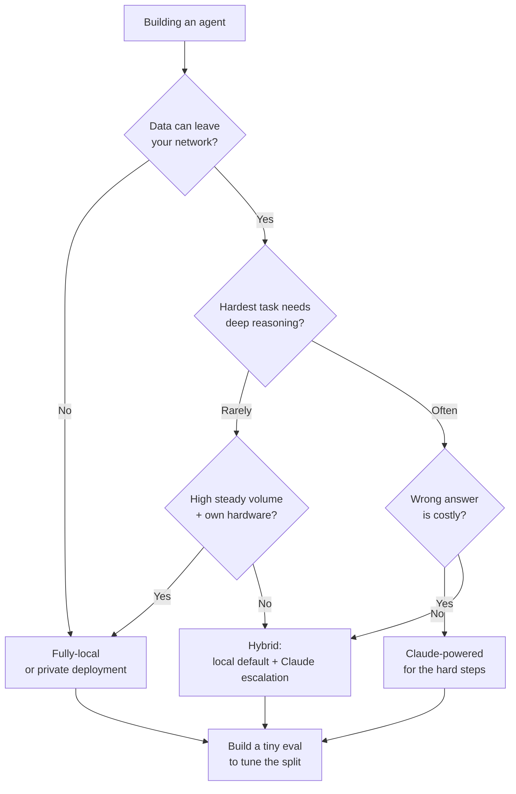

<LevelBadge level="intermediate" />

你正在构建一个智能体。第一个真正的岔路口是：它是运行在**完全本地**的开放权重模型上（私密、运行免费、完全归你所有），还是运行在 **Claude** 上（前沿质量、托管），抑或是两者的**混合**？本页是一个决策框架——真正决定选择的因素、一套清晰的"如果 X → 倾向 Y"流程，以及一个诚实的现实：**混合方案通常胜出**——本地承担简单/敏感的 90%，Claude 处理困难的 10%。

<Callout type="objectives" items={[
  "指出真正决定本地、Claude 还是混合方案的因素",
  "为你的智能体走一遍清晰的'如果 X → 倾向 Y'决策流程",
  "理解为什么混合方案（本地默认 + Claude 升级）往往优于任一极端",
  "带走一个小型评测作为你的决胜手段——而不是排行榜",
]} />

<VerifyNote lastVerified="2026-06-28" source="https://artificialanalysis.ai/">
这里的持久性结论——*顶尖开放权重模型与前沿模型之间存在能力差距，但正在不断缩小*，以及*路由/级联（先用便宜模型、遇难升级）在保持质量的同时节省成本*——是稳定的。但**具体数字**（本月差距有多大、哪个开放模型领先、Claude 的每 token 价格、给定硬件上确切的每秒 token 数）会不断变动。请把任何具体数字都当作易腐信息，在押注前查阅像 [Artificial Analysis](https://artificialanalysis.ai/) 这样的实时追踪器。
</VerifyNote>

## 三个选项，一口气说完

- **完全本地智能体**——一个开放权重模型（Llama、Qwen、Mistral、DeepSeek 等）通过 Ollama/LM Studio/vLLM 运行在你自己的硬件上。数据永不离开你的机器；无每次调用成本；可离线工作；上限受你的硬件和模型天花板所限。→ [本地 AI 智能体](/docs/models/local-ai-agents)
- **由 Claude 驱动的智能体**——调用 Claude API。前沿的推理与工具使用，无需照看基础设施，即刻扩展；但数据会离开你的网络，你按调用付费，并且需要网络连接。
- **混合方案**——本地模型处理常规/敏感的大部分；困难或高风险的步骤升级到 Claude。这是大多数生产级智能体最终收敛到的模式。→ [Claude + 本地模型](/docs/models/claude-plus-local-models)

## 真正决定选择的因素

把你的智能体拿去逐条对照。大多数决策仅凭前两三条就能定下来。

| 因素 | 倾向**本地**当…… | 倾向 **Claude** 当…… |
|---|---|---|
| **数据敏感性 / 隐私** | 数据受监管或不能离开你的网络 | 数据非敏感，或你有合规的数据协议 |
| **任务难度与推理深度** | 任务范围窄、界定清晰、重复性高 | 任务需要深度多步推理、长上下文、棘手的工具使用 |
| **可靠性需求** | 出错时重试一次或人工介入即可 | 每一步都必须正确；失败代价高 |
| **延迟** | 本地硬件响应足够快 | 你宁愿花钱买速度也不想配置 GPU |
| **你的量级下的成本** | 高且稳定的量——固定硬件可摊薄成本 | 量低/波动大——按调用付费胜过闲置的 GPU |
| **离线要求** | 必须在物理隔离/无网络环境下运行 | 始终在线没问题 |
| **你拥有的硬件** | 你拥有性能足够的 GPU / 统一内存 | 你没有，也不想购买/租用 |
| **照看预算** | 你有精力去调优、量化、评测、维护它 | 你希望它"开箱即用"、零运维 |

**通常决定选择的两条：** 如果数据*不能*离开你的网络，光这一点就把你推向本地（或私有部署），无论其他一切如何。如果可以离开，那么**任务难度**就是下一个摆动因素——简单工作在本地做很便宜；困难推理才是[前沿差距](/docs/models/choosing-a-model)仍会咬人的地方。

<Callout type="info" items={[
  "开放权重与前沿模型之间的能力差距真实存在但正在快速缩小——顶尖开放模型在常规和许多编码任务上表现出色，但在最困难的智能体、长跨度和深度推理工作上仍然落后于大多数前沿模型。",
  "正是这种不对称让混合方案变得强大：把简单/敏感的大多数发往本地，把 Claude 留给真正需要前沿推理的那一小片。",
]} />

## 决策流程

<Steps items={[
  {title: "数据能离开你的网络吗？", body: "如果否 → 本地（或私有/VPC 部署）就是你的基线。隐私是硬约束，不是偏好——它压倒其他因素。如果是 → 继续往下走。"},
  {title: "你的智能体必须做的最难的事有多难？", body: "如果每个任务都范围窄且重复 → 一个好的本地模型很可能达标；倾向本地。如果某些步骤需要深度推理、长上下文或精细的多工具编排 → 至少对那些步骤倾向 Claude。"},
  {title: "答错的代价有多高？", body: "如果失误只意味着重试一次或人工瞄一眼 → 本地的容错度足够。如果单个坏步骤代价高昂或不安全 → 在关键处偏向 Claude 的可靠性。"},
  {title: "你的量级和硬件如何？", body: "在你已拥有的硬件上有高且稳定的量 → 本地能漂亮地摊薄成本。量低或波动、没有 GPU → Claude 的按调用付费避免了闲置铁块。"},
  {title: "你真的想运行基础设施吗？", body: "愿意量化、部署、监控并重新评测模型 → 本地/混合可行。想要零运维 → Claude，或者一个本地部分极其简单的混合方案。"},
  {title: "默认选混合，然后证明你不需要它", body: "本地模型作为默认工作者；Claude 作为困难/高风险那一片的升级路径。从这里开始，除非第 1 步强制纯本地，或任务一致地困难（那就纯 Claude）。"},
]} />

## 为什么混合方案常常胜出

大多数真实工作负载都是**失衡的**：绝大多数请求简单和/或敏感，而一小部分是真正困难的。混合方案直接利用了这种形态。

- **本地处理简单/敏感的 90%**——快速、边际免费、私密、可离线。你流量的大头永远不会碰到 API。
- **Claude 处理困难的 10%**——那些多步推理、模棱两可的边缘情况、正确与否至关重要的步骤。你只在需要前沿质量的那一片上支付前沿价格。

这就是**级联 / 路由**模式：先尝试便宜的（本地）模型；当质量信号表明本地答案不够好时升级到 Claude，或者在前端用一个难度/敏感度分类器来路由。这是一种成熟的做法，能保住大部分质量，却只支付全前沿成本的一小部分——而且它兼作隐私边界，因为敏感情况可以被固定为"仅本地"。

<PromptCard title="在投向某个极端之前的自检">{`Answer for YOUR agent:
1. Must any data stay on my machine?            (yes -> local baseline)
2. What % of tasks are genuinely HARD?          (high -> Claude leans heavier)
3. What's a wrong answer cost me?               (high -> Claude on those steps)
4. My volume + hardware?                        (high+own GPU -> local amortizes)
5. Can I babysit infra?                         (no -> Claude or simple hybrid)

If answers conflict -> you've just described a HYBRID.
Now build the tiny eval below and let DATA pick the split.`}</PromptCard>

诚实的告诫：混合方案**活动部件更多**——两条模型路径、一个路由器，以及一个要维护的质量信号。如果你的智能体一致地简单*或*一致地困难，单模型方案更简单，而且很可能是对的。当你的工作负载真正失衡时，才伸手去拿混合方案。

<Flashcards title="决策指南词汇" cards={[
  {front: "完全本地智能体", back: "由运行在你自己硬件上的开放权重模型驱动的智能体。私密、无每次调用成本、可离线；受你的硬件和模型天花板所限。"},
  {front: "由 Claude 驱动的智能体", back: "调用 Claude API 的智能体。前沿的推理与工具使用、无需基础设施、即刻扩展；数据会离开你的网络且你按调用付费。"},
  {front: "混合方案（级联 / 路由）", back: "本地模型处理简单/敏感的大多数；Claude 处理困难/高风险的少数。先试便宜再升级，或在前端按难度/敏感度路由。"},
  {front: "通常的决定性因素", back: "先看数据敏感性（它能离开网络吗？），再看任务难度（最难的一步有多难？）。其余都是决胜的次要因素。"},
  {front: "能力差距", back: "顶尖开放权重模型主要在最困难的推理/智能体任务上落后于前沿模型。真实但正在缩小——这正是混合方案如此有效的原因。"},
]} />

<Quiz title="自我检查" questions={[
  {q: "你的智能体处理的数据在法律上不能离开你的网络。这首先意味着什么？", options: ["用 Claude——它质量更高", "完全本地或私有部署是基线，无论其他因素如何", "选每 token 最便宜的那个"], answer: 1, explain: "隐私是硬约束。如果数据不能离开网络，那就压倒整个决策——在你权衡任何其他因素之前，本地（或私有/VPC 部署）就是你的基线。"},
  {q: "对于典型的、失衡的工作负载，为什么混合智能体常常胜出？", options: ["前沿模型在规模化时总是更便宜", "本地廉价且私密地处理简单/敏感的大多数；Claude 被留给需要前沿推理的困难少数", "它消除了任何评测的需要"], answer: 1, explain: "大多数工作负载都是失衡的。把简单/敏感的 90% 路由到本地模型、把困难的 10% 路由到 Claude，能以全前沿成本的一小部分保住大部分质量——并把敏感情况固定在本地。"},
  {q: "什么时候单模型方案（纯本地或纯 Claude）比混合方案更明智？", options: ["总是——混合方案永远不值得", "当工作负载一致地简单或一致地困难时，此时额外的路由器和质量信号机制没有物尽其用", "只有在你没有 GPU 时"], answer: 1, explain: "混合方案增加了活动部件（两条路径、一个路由器、一个质量信号）。如果你的任务全都简单或全都困难，一个模型更简单，而且通常是对的。混合方案在工作负载真正失衡时才有回报。"},
]} />

## 然后做那件唯一能一锤定音的事：测试它

上面的每个因素都在缩小范围；**一个小型评测才能挑出赢家。** 不要凭感觉或凭公开排行榜来选。

- 从你的实际工作负载中收集 **10–50 个真实案例**，附带已知的正确答案（包括你最难和最敏感的案例）。
- 让你的候选名单——一个候选本地模型、Claude，以及（如相关）一个混合路由器——跑一遍相同的案例。
- 为质量打分，然后在**你真实量级下权衡成本与延迟**。一个 2% 的质量提升如果要花 10 倍成本可能不值得；而在必须正确的那一步上 2% 的提升可能是不可妥协的。
- 对于混合方案，评测还会告诉你**该在哪里画线**——什么升级到 Claude，什么留在本地。

保留这个评测。当一个新的开放权重模型发布或定价变动时，重跑一遍就把一次令人紧张的迁移变成五分钟的检查。→ [评测](/docs/power-user/evals)

<Callout type="takeaways" items={[
  "按顺序决定：先看数据敏感性（它能离开网络吗？），再看任务难度（最难的一步有多难？）。其余——延迟、量级、硬件、照看预算——都是决胜的次要因素。",
  "纯本地在隐私、离线以及稳定高量下的成本上胜出；Claude 在最困难的推理、可靠性和零运维扩展上胜出。",
  "混合方案通常在失衡的工作负载上胜出：本地承担简单/敏感的 90%，Claude 处理困难的 10%——级联/路由，只在前沿价格物有所值处才支付。",
  "开放权重的差距真实但正在缩小——这正是它让混合方案在今天如此有效的原因。",
  "不要凭感觉决定：在你自己的数据上构建一个小型评测，在你自己的量级下权衡成本与延迟，并为下一次模型发布保留它。",
]} />

## 来源与延伸阅读

- [Artificial Analysis](https://artificialanalysis.ai/)——横跨开放与前沿模型的独立、频繁更新的能力/价格/速度对比（重新核查易腐具体数字的地方）。
- [Anthropic — 模型概览](https://docs.anthropic.com/en/docs/about-claude/models)——Claude 当前的产品阵容、上下文与能力。
- [Anthropic — API 定价](https://www.anthropic.com/pricing)——用于估算你在量级下的成本的当前每 token 价格。
- [Ollama](https://ollama.com/) · [LM Studio](https://lmstudio.ai/)——在本地运行开放权重模型，用于本地/混合路径。
- [Meta — Llama](https://www.llama.com/) · [Mistral — Models](https://docs.mistral.ai/getting-started/models/)——本地智能体中常用的开放权重模型系列。

## 下一步

- 搭建本地一侧 → [本地 AI 智能体](/docs/models/local-ai-agents)
- 接上混合方案 → [Claude + 本地模型](/docs/models/claude-plus-local-models)
- 从大局把握这个选择 → [选择一个模型](/docs/models/choosing-a-model)
- 让决策可衡量 → [评测](/docs/power-user/evals)
