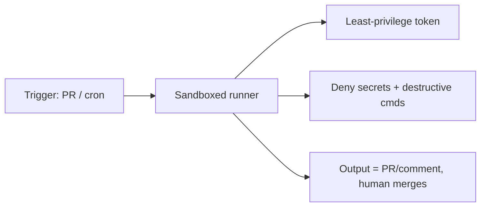

<LevelBadge level="advanced" />

以[无头模式](/docs/claude-code/headless-and-agent-sdk)运行 Claude，或按[计划任务](/docs/claude-code/background-tasks)运行它——在 CI、定时任务（cron）、预提交钩子中——意味着移除了那个本应及时拦截危险操作的人。这份便利恰恰是这类运行需要最严密护栏的原因。

## 无人值守运行特有的风险

- **无人能在当下对一次危险的工具调用说"不"。**
- **环境凭证（ambient credentials）。** CI 通常持有强大的令牌（部署、软件包仓库、云）。运行在其中的智能体会继承这些权限。
- **不可信的输入。** 由某个 PR 或 issue 触发的运行，可能会处理攻击者撰写的内容（[注入](/docs/security/prompt-injection)）。

## 加固清单

- **显式拒绝机密访问。** 通过[权限拒绝规则](/docs/claude-code/permissions)阻止读取 `.env`、密钥文件和凭证路径。不要指望模型主动避开它们。
- **绝不要在拥有真实访问权限的机器上使用 bypass/yolo 模式。** 把"跳过所有提示"保留给一次性的沙箱环境。
- **限定令牌权限。** 给该运行分配一个最小权限令牌（尽可能只读），而不是你的完全访问凭证。
- **沙箱化与临时化。** 在一个用完即销毁的容器中运行；不要保留对生产环境的持久访问。
- **对命令和域名设置白名单。** 允许你的测试/lint/构建命令，拒绝联网的或破坏性的命令。
- **设置上限。** 最大迭代次数、时间预算、令牌/成本预算——这样即使陷入循环或被操纵，智能体也无法失控狂奔。
- **让输出可供审查，而非自动应用。** 优先选择"开一个 PR / 发一条评论"，而不是"推送到 main"。由人来合并。

## 示例：一个安全的 CI 代码审查器

一个 PR 审查机器人应当：以只读方式检出代码、**没有**任何部署/机密访问权限、在容器中运行，并将其发现以**评论**形式发布——绝不修改受保护的分支。参见 [PR 审查实战演练](/docs/walkthroughs/pr-review-action)。

## 下一步

- [权限与权限模式](/docs/claude-code/permissions)
- [保护智能体与工具](/docs/security/securing-agents)
- [无头模式与 Agent SDK](/docs/claude-code/headless-and-agent-sdk)
