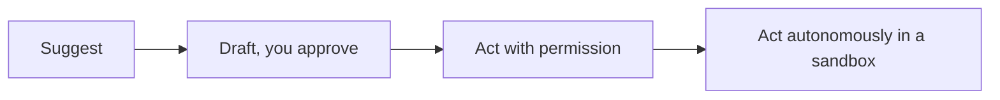

<LevelBadge level="all" />

要充分发挥 AI 的价值，也包括*负责任地*使用它。本页内容简短、实用，适用于每一个人——从初学者到构建者。

## 验证心态

最重要的一个习惯：**让你的验证程度与风险高低相匹配。**

| 风险 | 示例 | 需要多少验证 |
|---|---|---|
| 低 | 头脑风暴、粗略草稿 | 放心采用，略读即可 |
| 中 | 一封工作邮件、一份摘要 | 通读一遍，对事实做个常识检查 |
| 高 | 待发布的统计数据、你将运行的代码、法律/医疗/财务事项 | 对照可信来源核实每一项断言 |

AI 是一份快速的初稿，绝非最终权威——参见[幻觉](/docs/foundations/hallucinations)。

## 自主性阶梯

只有在信任逐步建立之后，才给 AI 更多的独立性：

从"提出方案，由我批准"开始（[规划模式](/docs/claude-code/plan-mode)）；把完全自主权保留给低风险、沙箱化、可逆的工作（[加固自主运行](/docs/security/hardening-autonomous-runs)）。

## 隐私与数据

- 不要把机密、凭证或他人的个人数据粘贴进一个你尚未审查过的工具。
- 在分享敏感材料之前，先了解你的服务提供商的数据处理与训练政策——参见[隐私与数据处理](/docs/foundations/privacy)。
- 对于受监管或机密的数据，请使用相应的企业版/受控设置。

## 偏见、公平性与局限

模型会反映其训练数据中的模式，而这些模式可能带有**偏见**。当 AI 的输出会影响到关于人的决策（招聘、放贷、内容审核）时，要格外谨慎。让人对重大决策负责，并把 AI 当作判断的辅助，而非替代品。

## 不要把思考外包出去

:::tip 用 AI 来更好地思考，而不是更少地思考
最优秀的用户始终保持投入——他们质疑输出、从中学习，并对结果负责。对于学习而言，这意味着采用[复述教学循环（teach-back loop）](/docs/playbooks/learning)，而非复制粘贴。你要对借助 AI 交付的成果负责。
:::

## 安全，简而言之

只要 AI 读取了不可信内容（网页、邮件、文档）或采取了行动，你就承袭了一套安全模型。请阅读[提示词注入](/docs/security/prompt-injection)与[保护智能体](/docs/security/securing-agents)。

## 下一步

- [提示词注入详解](/docs/security/prompt-injection)
- [幻觉及其缓解之道](/docs/foundations/hallucinations)
- [隐私与数据处理](/docs/foundations/privacy)
