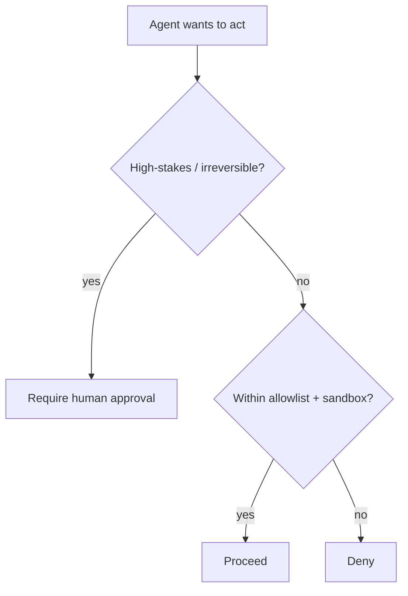

<LevelBadge level="advanced" />

一旦 AI 能够**采取行动**（调用工具、运行代码、访问 API），它就承袭了一套安全模型。目标不是让模型变得无法被欺骗——而是要确保**即便它被骗了，也造不成多大破坏**。

## 核心原则：最小权限

只给智能体完成其工作所需的**最小**访问权限，多一分都不给。

- 一个文档摘要器需要**读取**权限，而不需要写入或网络权限。
- 一个审查器需要读取代码并发表评论——而不需要推送或部署。
- 按任务逐一限定工具、API 密钥和文件访问的范围。一个范围被收窄的智能体即便遭到[注入](/docs/security/prompt-injection)，也只能造成有限的破坏。

## 混淆代理问题

智能体往往**以你的权限**行事（用你的令牌、你的会话）。如果攻击者可控的输入操纵了它，攻击者就借用了你的权限——这就是"混淆代理（confused deputy）"。防御之道：不要把智能体不需要的环境权限交给它，并要求敏感工具使用明确的、限定范围的凭证。

## 防御层

1. 对代码执行和文件访问进行**沙箱化**——使用容器、临时目录，不允许访问更广泛的系统或机密。
2. 对危险面设置**白名单**：允许哪些命令、哪些域名、哪些路径。其余一律拒绝。（在 Claude Code 中，这就是[权限](/docs/claude-code/permissions)。）
3. 对不可逆或高风险操作采用**人工介入（human-in-the-loop）**：转账、发邮件、删除、部署、更改生产环境配置。
4. **隔离信任区。** 不要让同一个智能体同时持有机密、读取不可信内容并发起任意出站调用。
5. **记录并审查**智能体实际调用了哪些工具。

## 工具有 schema——请校验它们

模型生成的工具输入可能出错或被操纵。在执行前**校验**参数，并**把错误作为结果返回**，让智能体得以恢复，而不是盲目重试。

## 下一步

- [提示词注入详解](/docs/security/prompt-injection)
- [加固自主运行](/docs/security/hardening-autonomous-runs)
- [审查第三方代码](/docs/security/reviewing-third-party-code)
