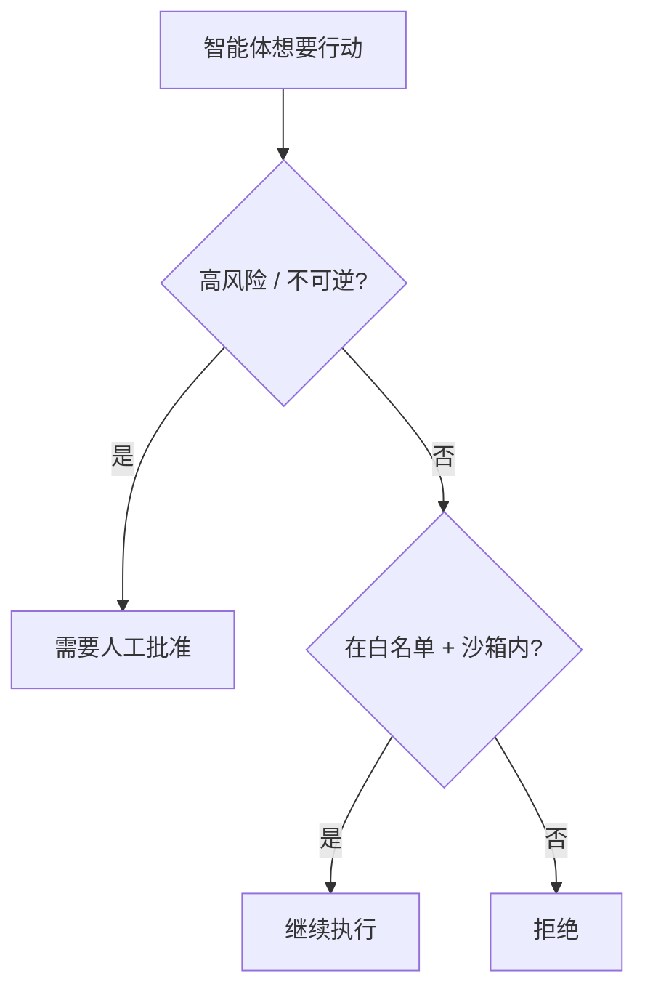

<LevelBadge level="advanced" />

<Callout type="objectives" items={["应用最小权限——只给智能体完成其工作所需的访问权限", "识别混淆代理问题：智能体借用了你的权限", "叠加五重防御，在智能体被欺骗时缩小影响范围", "决定哪些操作需要人工介入", "校验工具输入，使一个错误或被操纵的参数无法执行"]} />

当 AI 能够**采取行动**（调用工具、运行代码、请求 API）的那一刻，它就继承了一套安全模型。目标不是让模型无法被欺骗——而是确保**即使它被欺骗，也不会造成太大的危害**。

## 核心原则：最小权限

只给智能体完成其工作所需的**最小**访问权限，不多给。

- 文档摘要器需要**读取**权限，而不需要写入或网络。
- 审查者需要读取代码并发表评论——而不需要推送或部署。
- 按任务逐一限定工具、API 密钥和文件访问的范围。一个范围受限的智能体即使遭到[注入](/docs/security/prompt-injection)，也只能造成有限的损害。

## 混淆代理问题

智能体往往**以你的权限**行事（用你的令牌、你的会话）。如果攻击者可控的输入操纵了它，攻击者就借用了你的权限——这就是"混淆代理"。防御之道：不要把智能体不需要的环境权限交给它，并要求敏感工具使用明确的、限定范围的凭证。

## 防御层

层层叠加——没有任何单一防御是足够的。每一层都假设它上面的那些层可能会失效。

<Steps items={[
  {title: "沙箱化执行与文件访问", body: "在容器或临时目录中运行代码和文件操作，使其无法访问更广泛的系统或机密。如果智能体被欺骗，它只能在盒子里折腾。"},
  {title: "为危险面设置白名单", body: "决定允许哪些命令、哪些域名和哪些路径——其余一律拒绝。在 Claude Code 中，这就是权限（/docs/claude-code/permissions）。"},
  {title: "高风险操作需人工介入", body: "对不可逆或敏感的操作要求明确批准：转账、发送邮件、删除、部署或更改生产环境配置。"},
  {title: "隔离信任区", body: "不要让同一个智能体同时持有机密、读取不可信内容并发起任意出站调用——这种组合正是数据外泄的路径。"},
  {title: "记录并审查工具调用", body: "记录智能体实际调用了哪些工具以及使用了什么参数，以便你审计行为并发现偏移。"}
]} />

## 把白名单写下来

"为危险面设置白名单"很容易点头认同，也很容易被跳过。在 Claude Code 中它是具体的：一个 `settings.json`，只允许任务所需的那一小组命令和域名，并拒绝其余。从严格开始，只在真实任务被阻塞时才放宽。

<PromptCard title="一个最小权限的 Claude Code 权限配置块">{`{
  "permissions": {
    "allow": [
      "Read",
      "Edit",
      "Bash(npm test:*)",
      "Bash(npm run build:*)",
      "Bash(git status)",
      "Bash(git diff:*)"
    ],
    "deny": [
      "Bash(git push:*)",
      "Bash(rm:*)",
      "Bash(curl:*)",
      "Read(./.env)",
      "Read(./secrets/**)"
    ]
  }
}`}</PromptCard>

`deny` 列表优先于 `allow`，所以即使授予了宽泛的 `Read`，对 `.env` 和 `secrets/**` 的封锁仍然有效。有关完整的规则语法和优先级，请参阅[权限](/docs/claude-code/permissions)。

## 工具都有模式（schema）——请校验它们

模型生成的工具输入可能出错或被操纵。在执行前**校验**参数，并**把错误作为结果返回**，让智能体得以恢复，而不是盲目重试。

<Flashcards title="强化核心术语" cards={[{front: "最小权限", back: "只给智能体完成其特定工作所需的访问权限——不多给。一个范围受限的智能体即使被欺骗，也只能造成有限的损害。"}, {front: "混淆代理", back: "智能体以你的权限行事（用你的令牌、你的会话）。如果攻击者可控的输入操纵了它，攻击者就借用了你的权限。"}, {front: "沙箱", back: "在隔离的容器或临时目录中运行代码和文件访问，使其无法通向更广泛的系统或机密，从而让被欺骗的智能体被困在盒子里。"}, {front: "信任区", back: "把机密、不可信内容和出站网络分置于不同的智能体中。一个智能体同时持有这三者就是数据外泄的路径。"}, {front: "人工介入", back: "在不可逆或敏感操作之前设置的必需人工批准关卡——转账、删除、部署、更改生产环境配置。"}]} />

<Quiz title="自我检测" questions={[
  {
    q: "在配置智能体时，最小权限原则要求你做什么？",
    options: ["给它宽泛的访问权限，使它永远不会在任务中途被阻塞", "只给它完成其特定工作所需的访问权限", "给它与运行它的人相同的权限"],
    answer: 1,
    explain: "最小权限意味着工作所需的最小访问权限。一个范围受限的智能体即使遭到注入，也只能造成有限的损害。"
  },
  {
    q: "为什么一个以你的令牌行事的智能体构成'混淆代理'风险？",
    options: ["它会混淆该调用哪个模型", "攻击者可控的输入可以操纵它使用你的权限", "它未经询问就把其他智能体设为代理"],
    answer: 1,
    explain: "智能体持有你的权限。如果攻击者可控的输入操纵了它，攻击者实际上就借用了你的权限——这就是混淆代理问题。"
  },
  {
    q: "在 Claude Code 的权限配置块中，哪一项能可靠地阻止智能体读取机密文件？",
    options: ["一个针对 Read 的 allow 项", "一个针对机密路径的 deny 项，因为 deny 优先于 allow", "移除 Bash 工具"],
    answer: 1,
    explain: "deny 优先于 allow，所以即使授予了宽泛的 Read，针对 secrets/** 的 deny 仍然有效。"
  }
]} />

<Callout type="takeaways" items={["最小权限优先：按任务逐一限定工具、密钥和文件访问的范围，使被欺骗的智能体只能造成有限的损害", "智能体以你的权限行事——不要把它不需要的环境权限交给它（混淆代理问题）", "叠加这五层：沙箱、白名单、人工介入、隔离信任区、记录与审查", "在 Claude Code 中，deny 规则优先于 allow 规则——明确封锁 .env 和机密路径", "在执行前校验工具参数，并把错误作为结果返回，让智能体得以恢复而不是盲目重试"]} />

## 下一步

- [提示注入详解](/docs/security/prompt-injection)
- [加固自主运行](/docs/security/hardening-autonomous-runs)
- [审查第三方代码](/docs/security/reviewing-third-party-code)
