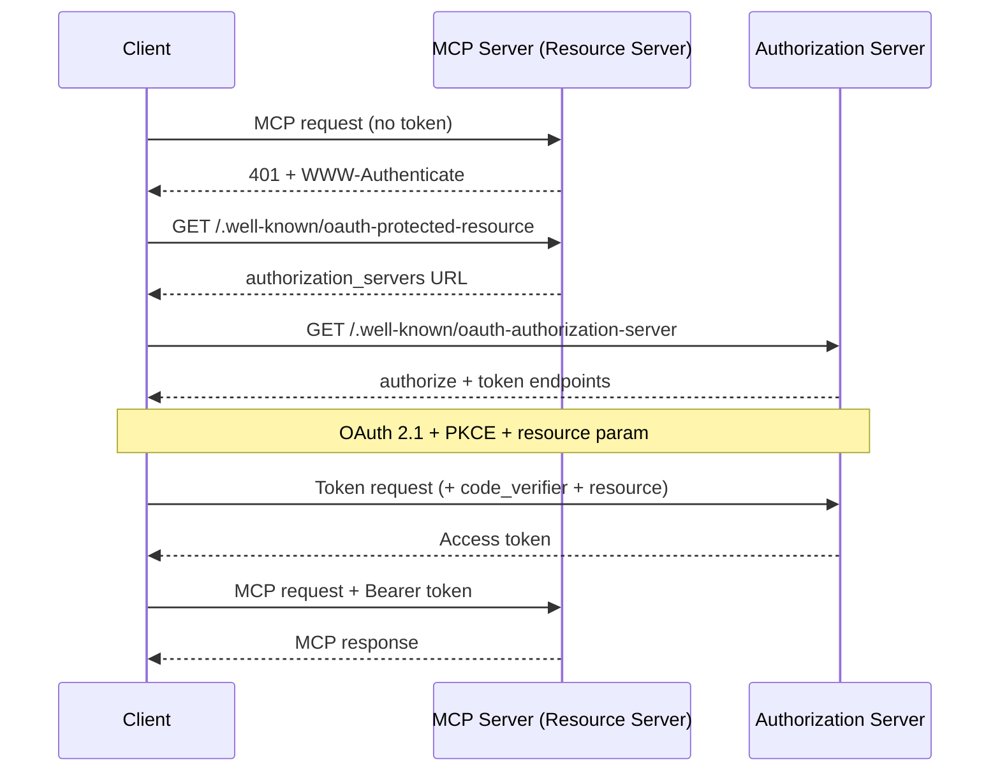
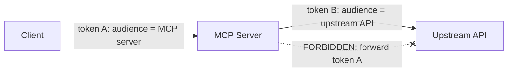

<LevelBadge level="advanced" />

<Callout type="objectives" items={["理解为什么一个远程（HTTP）MCP 服务器是一个 OAuth 2.1 资源服务器，而不仅仅是一个 API 密钥端点", "追踪发现握手过程：401 → Protected Resource Metadata → Authorization Server Metadata → 令牌", "解释令牌受众绑定（RFC 8707）以及它为什么能阻止一个服务的令牌在另一个服务上生效", "指出混淆代理陷阱以及封堵它的那一条规则：绝不将客户端的令牌透传给上游 API", "在把 MCP 服务器暴露到互联网之前，应用一份简短的加固检查清单"]} />

[MCP](/docs/claude-code/mcp) 已经从新鲜事物变成了智能体触达工具的默认方式——这意味着 MCP 服务器如今正守在真实数据和真实操作的前面。你通过 **STDIO** 启动的本地服务器信任它所处的环境：它从环境变量读取凭据，并且没有需要防御的网络边界。而一旦你把同一个服务器变成**远程**（HTTP），任何能访问到该 URL 的人都可以尝试调用它。这就把它变成了一个授权问题，而 MCP 规范用 **OAuth 2.1** 来回应——而不是一套定制的 API 密钥方案。

本页讨论的是远程场景。如果你的服务器只用 STDIO，规范明确表示*不要*走 OAuth 流程——从环境中获取凭据然后继续即可。

<VerifyNote lastVerified="2026-07-07" source="https://modelcontextprotocol.io/specification/2025-06-18/basic/authorization" />

## 三种角色

OAuth 把问题拆分给三方。MCP 干净地映射到它们之上：

<Flashcards title="谁是 MCP OAuth 流程中的谁" cards={[{front: "MCP server = Resource Server（资源服务器）", back: "被保护的东西。它接受携带访问令牌的请求，验证令牌，然后返回数据——如果令牌缺失或错误则返回 401。它并不负责让用户登录。"}, {front: "MCP client = OAuth client（OAuth 客户端）", back: "你的智能体宿主（Claude Code、桌面应用、你自己的代码）。它代表用户获取令牌，并将其作为 Bearer 头附加到每个请求上。"}, {front: "Authorization Server (AS)（授权服务器）", back: "真正与用户交互、获取同意并签发令牌的一方。它可以与服务器托管在一起，也可以是一个独立的身份提供方。其内部实现不在 MCP 的范围之内。"}]} />

关键的思维转变：**MCP 服务器自己从不处理登录。** 它只验证别人签发的令牌。正是这种分离让你能在一个自己编写的服务器前面放上一个现成的身份提供方。

## 发现握手

客户端不应当需要预先配置好在哪里进行认证。MCP 让发现过程自动化，由一个 `401` 驱动：

<Steps items={[
  {title: "客户端不带令牌调用服务器", body: "第一个请求裸奔发出。服务器以 HTTP 401 Unauthorized 拒绝它，并附带一个指向其资源元数据 URL 的 WWW-Authenticate 头。"},
  {title: "客户端获取 Protected Resource Metadata（RFC 9728）", body: "它对服务器的 /.well-known/oauth-protected-resource 发起 GET 请求。该文档的 authorization_servers 字段列出了至少一个客户端可用的 Authorization Server。"},
  {title: "客户端获取 Authorization Server Metadata（RFC 8414）", body: "它对 AS 的 /.well-known/oauth-authorization-server 发起 GET 请求，以了解 authorize 和 token 端点以及所支持的能力。"},
  {title: "可选：动态客户端注册（RFC 7591）", body: "如果客户端在这个 AS 上没有 client ID，它可以 POST /register 在无人参与的情况下获取一个——这一点至关重要，因为客户端无法预先知道每一个 MCP 服务器。"},
  {title: "使用 PKCE + resource 的 OAuth 2.1 授权", body: "客户端生成 PKCE verifier/challenge，打开浏览器访问包含 resource 参数的 authorize URL，用户同意，然后客户端用返回的 code（连同 verifier）换取访问令牌。"},
  {title: "客户端携带令牌重试", body: "现在每个请求都携带 Authorization: Bearer <token>。服务器验证它并作出响应。"}
]} />

注意客户端一侧**没有任何硬编码的认证配置**——是那个 `401` 引导了一切。这正是重点所在：智能体可以连接到一个它从未见过的服务器，并弄清楚该如何认证。

## 受众绑定：那条承重的规则

下面就是受众绑定要防范的失效模式。假设某个用户持有一个为 `calendar.example.com` 签发的令牌。位于 `evil.example.com` 的一个恶意（或只是马虎）的 MCP 服务器诱使客户端把*那个*令牌发给它。如果 `evil` 接受了它，它现在就可以转身以该用户的身份去调用日历 API。一个服务的令牌在另一个服务上生效了。OAuth 的安全边界就此崩塌。

修复办法是 **Resource Indicators（RFC 8707）**：

<Steps items={[
  {title: "客户端声明目标", body: "在授权请求和令牌请求中，客户端都必须包含一个 resource 参数，设置为它打算调用的 MCP 服务器的规范 URI——例如 resource=https://mcp.example.com。即便不确定 AS 是否支持，它也会发送这个参数。"},
  {title: "AS 将令牌绑定到该受众", body: "在受支持的情况下，AS 会给令牌打上标记，使其只对那个特定的资源服务器有效。"},
  {title: "服务器验证受众", body: "在做任何工作之前，MCP 服务器必须核实令牌是为它自己签发的——检查 audience 声明（RFC 9068）。为其他任何人铸造的令牌都会得到 401，没有任何余地。"}
]} />

<PromptCard title="授权请求上的 resource 参数（URL 编码）">{`&resource=https%3A%2F%2Fmcp.example.com`}</PromptCard>

规范 URI 有严格要求：`https://mcp.example.com` 和 `https://mcp.example.com:8443/mcp` 是有效的；`mcp.example.com`（无 scheme）和 `https://mcp.example.com#frag`（带 fragment）则无效。为了互操作性，优先使用不带末尾斜杠的形式。

## 混淆代理：绝不透传令牌

这是把一个善意的 MCP 服务器变成攻击者代理的错误。它就是智能体安全中那个同样的[混淆代理问题](/docs/security/securing-agents)，被磨成了一条具体的规则。

MCP 服务器常常需要调用**上游 API**（GitHub、某个数据库服务、另一个 SaaS）。诱惑在于：把客户端交给你的令牌拿去转发到上游。**不要这么做。** 规范说得很直白：MCP 服务器**绝不能**透传它从客户端收到的令牌。

为什么危险：客户端的令牌是以*你的*服务器为受众签发的。如果你转发它，上游 API 可能会像它来自你一样信任它，或者假设你已经验证过它——于是一个仅限一跳的令牌就在两跳之外做起了工作，游离于任何人的同意模型之外。

<Callout type="warning" items={["如果你的 MCP 服务器要调用上游 API，它就是作为一个独立的 OAuth 客户端去访问那个 API，并从上游的授权服务器获取它自己的令牌。两个独立的令牌，两个独立的受众。客户端的令牌止步于你的门口。"]} />

## 一份起飞前的加固检查清单

在远程 MCP 服务器接触公共互联网之前：

<Steps items={[
  {title: "一切都通过 HTTPS 提供", body: "所有 AS 端点都必须使用 HTTPS。重定向 URI 必须是 HTTPS 或 localhost——别无其他。"},
  {title: "对每个请求验证受众", body: "拒绝任何不是专门为本服务器签发的令牌。这是阻止跨服务令牌复用的那一道单一检查。"},
  {title: "强制要求 PKCE", body: "客户端必须使用 PKCE，这样即使授权码被拦截，没有匹配的 verifier 也毫无用处。"},
  {title: "固定精确的重定向 URI", body: "AS 必须将重定向 URI 与预先注册的值精确匹配，且客户端应当使用并验证 state 参数——两者都能抵御开放重定向钓鱼。"},
  {title: "短寿命令牌 + 刷新轮换", body: "签发短寿命的访问令牌以限制泄露造成的损害；对于公开客户端，轮换刷新令牌。安全地存储令牌，绝不记录它们。"},
  {title: "绝不把令牌放进 URL", body: "令牌放在 Authorization 头里，绝不放在查询字符串中，否则它们会落到日志和 referrer 里。"},
  {title: "叠加智能体安全的基本功", body: "受众绑定是传输层的门禁；仍要应用来自 /docs/security/securing-agents 的最小权限、沙箱化和人机协同。认证说明的是「谁」——它并不说明请求是安全的。"}
]} />

## 自我检查

<Quiz title="自我检查" questions={[
  {
    q: "一个远程 MCP 服务器收到了一个不带访问令牌的请求。规范要求它首先做什么？",
    options: [
      "提示用户输入用户名和密码",
      "返回 HTTP 401，并附带一个指向其资源元数据 URL 的 WWW-Authenticate 头",
      "静默地把请求代理到它的上游 API",
      "自己给客户端签发一个令牌"
    ],
    answer: 1,
    explain: "该服务器是一个资源服务器，而不是一个登录页面。它以 401 + WWW-Authenticate 回应不带令牌的请求，从而引导客户端发现授权服务器。"
  },
  {
    q: "令牌受众绑定（RFC 8707）在防范什么？",
    options: [
      "缓慢的令牌验证",
      "为某个服务签发的令牌被另一个服务接受并复用",
      "用户忘记密码",
      "过大的上下文窗口"
    ],
    answer: 1,
    explain: "resource 参数将令牌绑定到它被铸造时所针对的那个特定服务器。服务器随后验证 audience 声明，并拒绝任何为他人签发的令牌——从而封堵跨服务复用的漏洞。"
  },
  {
    q: "你的 MCP 服务器需要调用上游的 GitHub API。它应当如何处理客户端发给它的访问令牌？",
    options: [
      "把同一个令牌转发给 GitHub 以省去一次往返",
      "不用它与 GitHub 交互——作为一个 OAuth 客户端去 GitHub 获取自己独立的令牌，绝不透传客户端的令牌",
      "记录该令牌以便日后重放",
      "把令牌放进 GitHub 请求的 URL 里"
    ],
    answer: 1,
    explain: "把客户端的令牌传给上游就是混淆代理陷阱，并且是被明确禁止的。服务器作为它自己的 OAuth 客户端去访问上游 API，使用一个绑定到该 API 受众的独立令牌。"
  },
  {
    q: "对于一个 STDIO（本地）MCP 服务器，规范说凭据应当如何处理？",
    options: [
      "每次启动都跑一遍完整的 OAuth 2.1 浏览器流程",
      "从环境中获取它们——OAuth 授权流程是用于 HTTP 传输的，不用于 STDIO",
      "把它们硬编码在客户端里",
      "对所有传输方式完全跳过认证"
    ],
    answer: 1,
    explain: "规范说 STDIO 传输不应当走 HTTP 授权流程，而应从环境中读取凭据。这里的 OAuth 是专门针对远程的、基于 HTTP 的服务器的。"
  }
]} />

## 来源与延伸阅读

- [MCP Authorization specification (2025-06-18)](https://modelcontextprotocol.io/specification/2025-06-18/basic/authorization) — 本页所总结的规范性流程、角色以及 MUST/SHOULD 要求。
- [MCP Security Best Practices](https://modelcontextprotocol.io/specification/2025-06-18/basic/security_best_practices) — 令牌透传、混淆代理，以及为什么它们被禁止。
- [RFC 8707 — Resource Indicators for OAuth 2.0](https://www.rfc-editor.org/rfc/rfc8707.html) — `resource` 参数与受众绑定。
- [RFC 9728 — OAuth 2.0 Protected Resource Metadata](https://datatracker.ietf.org/doc/html/rfc9728) — 资源服务器如何公告它的授权服务器。
- [RFC 8414 — OAuth 2.0 Authorization Server Metadata](https://datatracker.ietf.org/doc/html/rfc8414) 与 [RFC 7591 — Dynamic Client Registration](https://datatracker.ietf.org/doc/html/rfc7591)。
- [OAuth 2.1 draft](https://datatracker.ietf.org/doc/html/draft-ietf-oauth-v2-1-13) — PKCE、通信安全以及令牌处理要求。
- AILmanac 相关内容：[保护智能体与工具](/docs/security/securing-agents) · [提示注入](/docs/security/prompt-injection) · [Claude Code 中的 MCP](/docs/claude-code/mcp)。
