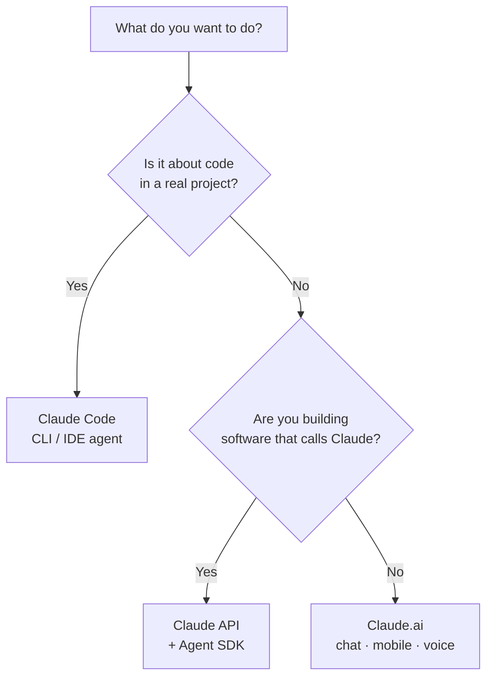

<LevelBadge level="beginner" />

"Claude"有好几种形态。按 **你想做什么** 来选，而不是按你听说过哪一个来选。

## 30 秒决策

## Claude.ai——聊天应用

**适合：** 写作、调研、分析、学习、规划、日常提问。**面向：** 所有人，无需任何设置。

你还能在 **移动端**（[iOS/Android](/docs/claude-app/mobile)）和通过 **[语音](/docs/claude-app/voice-mode)** 使用它——非常适合在路上随手捕捉灵感。用 [项目](/docs/claude-app/projects)、[自定义指令](/docs/claude-app/custom-instructions) 和 [Artifacts](/docs/claude-app/artifacts) 让它更强大。→ 从 [Claude.ai 入门](/docs/claude-app/getting-started) 开始。

## Claude Code——智能体式编码工具

**适合：** 在 *代码库里* 干活——读取、编辑、运行命令、修复测试。**面向：** 开发者（以及有技术好奇心的人）。它会在你授权的前提下对你的文件采取行动。→ [Claude Code 是什么](/docs/claude-code/what-is-claude-code)。

## API & Agent SDK——把 Claude 内建进你自己的软件

**适合：** 以编程方式调用 Claude 的应用、自动化和智能体。**面向：** 要发布产品或流水线的开发者。→ [你的第一次 API 调用](/docs/api/first-call)。

## 它们协同工作

这些并不是互相竞争的产品——大多数人会逐级用上它们：

| 你想…… | 用 |
|---|---|
| 起草一封邮件、总结一份 PDF、头脑风暴 | Claude.ai（或语音/移动端） |
| 重构一个模块、加测试、修一个 bug | Claude Code |
| 给 *你的* 应用加一个 AI 功能 | API / Agent SDK |

:::tip 拿不准？从聊天开始
[Claude.ai](/docs/claude-app/getting-started) 无需任何设置，并能教会你 Claude 是如何"思考"的。这些技能在其他任何地方都能迁移过去。
:::

## 下一步

- [你的最初 5 分钟](/docs/start-here/your-first-5-minutes)
- [学习路径](/docs/start-here/learning-paths)
- [选择一个 Claude 模型](/docs/api/choosing-a-model)（等你开始动手开发时）
