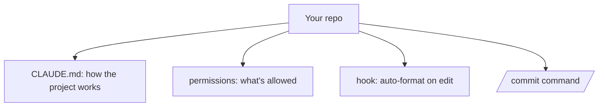

<LevelBadge level="intermediate" />

让我们用大约 20 分钟，把一个全新的代码签出变成一套*了解你的项目并尊重你的规则*的 Claude Code 配置。我们会把核心功能串联起来，并讲清楚每一项的理由。

## 最终状态



## 第 1 步 — 生成并精简 CLAUDE.md

运行 `/init` 来起草一份 [CLAUDE.md](/docs/claude-code/claude-md)，然后**精简它**，只保留真正成立的内容：技术栈、如何运行/测试/检查代码、真实的约定，以及护栏规则（"完成前先跑测试"、"不要碰 `/generated`"）。*原因：*它是杠杆率最高的定制项 —— Claude 每个会话都会读取它。

可以从 [CLAUDE.md 模板](/docs/templates/claude-md) 拿一份起步模板。

## 第 2 步 — 设置权限

添加一个 `.claude/settings.json`（[参考](/docs/claude-code/settings)），预先放行安全、重复的命令，并拒绝危险的命令：

```json
{
  "permissions": {
    "allow": ["Read", "Bash(npm run test:*)", "Bash(npm run lint)", "Bash(git diff:*)"],
    "ask": ["Write", "Bash(npm install:*)"],
    "deny": ["Read(./.env)", "Bash(git push --force:*)"]
  }
}
```

*原因：*在安全操作上减少打断，在有风险的操作上硬性叫停。参见 [权限](/docs/claude-code/permissions)。

## 第 3 步 — 添加一个格式化钩子

在每次编辑后自动格式化（[钩子](/docs/claude-code/hooks)）：

```json
{ "hooks": { "PostToolUse": [ { "matcher": "Edit|Write",
  "hooks": [ { "type": "command", "command": "npx prettier --write \"$CLAUDE_FILE_PATH\" 2>/dev/null || true" } ] } ] } }
```

*原因：*确保格式一致 —— 而不是"麻烦记得格式化一下"。

## 第 4 步 — 添加一个 `/commit` 命令

把 [斜杠命令库](/docs/templates/slash-commands) 里的 `/commit` 配方放进 `.claude/commands/`。*原因：*用一个词触发一套可复用的工作流。

## 第 5 步 — 用计划模式来完成第一个真实任务

在 [计划模式](/docs/claude-code/plan-mode) 中给出一个真实目标，审阅计划，然后让它执行。*原因：*通过把思考和执行分开来建立信任。

## 验证是否生效

- 新会话 → Claude 无需提示就引用了你的约定（CLAUDE.md 生效）。
- 编辑一个文件 → 它被自动格式化（钩子生效）。
- 一个有风险的命令 → 它会询问或拒绝（权限生效）。
- `/commit` → 一条干净的约定式提交（Conventional Commit）信息（命令生效）。

## 下一步

- [编写你的第一个技能](/docs/walkthroughs/first-skill)
- [钩子与 settings.json 配方](/docs/templates/hooks-settings)
- [编码与软件开发](/docs/playbooks/coding)
