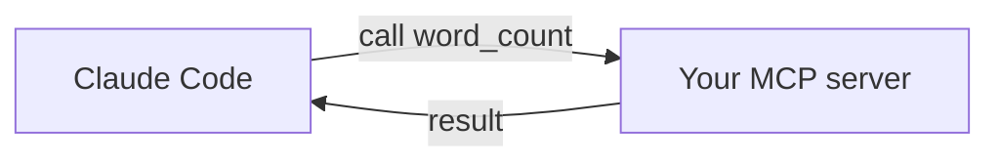

<LevelBadge level="advanced" />

<VerifyNote lastVerified="2026-06-20" source="https://modelcontextprotocol.io">
MCP SDK 的 API 和配置会不断演进 —— 请对照官方的 MCP 文档以及 Claude Code 的 MCP 文档进行确认。
</VerifyNote>

让我们通过构建一个极小的 [MCP](/docs/claude-code/mcp) 服务器并连接它，把一个自定义工具暴露给 Claude。我们会把它保持得尽量精简，让*接线方式*一目了然 —— 之后你再换上自己真正的逻辑。

## 我们要构建什么

一个带有单个工具 `word_count` 的 stdio 服务器，Claude 可以调用它。同样的模式可以扩展到"查询我的数据库"、"开一个工单"等等。



## 第 1 步 — 服务器

`server.py`（Python；TypeScript 版本见 [MCP 脚手架](/docs/templates/mcp-config)）：

```python
from mcp.server.fastmcp import FastMCP

mcp = FastMCP("text-tools")

@mcp.tool()
def word_count(text: str) -> int:
    """Count the words in a piece of text."""
    return len(text.split())

if __name__ == "__main__":
    mcp.run()  # stdio transport
```

## 第 2 步 — 声明它

把它添加到仓库根目录的 `.mcp.json` 中：

```json
{ "mcpServers": {
  "text-tools": { "command": "python", "args": ["server.py"] }
} }
```

## 第 3 步 — 连接并测试

在仓库中启动 Claude Code。问它：*"用 text-tools 服务器统计这段文字的词数：'the quick brown fox'。"* Claude 应该会调用 `word_count` 并报告 `4`。如果它看不到这个工具，请检查服务器能否独立干净地启动，以及 `.mcp.json` 的路径是否正确。

## 第 4 步 — 让它真正可用

把 `word_count` 替换成你实际的能力 —— 一次数据库查询、一次内部 API 调用、一次文件操作。加入输入校验，并把错误作为结果返回。

## 安全检查清单

:::warning 服务器 = 代码 + 访问权限
- **最小权限** —— 只给它所需的数据/操作（[保护 Agent](/docs/security/securing-agents)）。
- **校验**模型发来的输入。
- 它返回的不可信数据可能携带 [提示词注入](/docs/security/prompt-injection)。
- 在连接任何第三方服务器之前，先**审查**它。
:::

## 下一步

- [Claude Code 中的 MCP 服务器](/docs/claude-code/mcp)
- [MCP 配置与服务器脚手架](/docs/templates/mcp-config)
- [工具使用 / 函数调用](/docs/api/tool-use)
