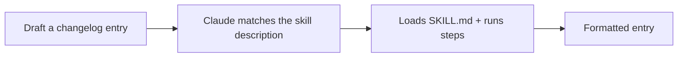

<LevelBadge level="intermediate" />

<VerifyNote lastVerified="2026-06-20" source="https://code.claude.com/docs/en/skills">
技能的布局和发现机制可能会变化 —— 请对照官方的 Skills 文档进行确认。
</VerifyNote>

让我们从零开始构建一个可用的 [技能（Skill）](/docs/claude-code/skills)，并验证它能被激活。我们会做一个小巧的"changelog 条目"技能 —— 通用且可复用。

## 第 1 步 — 创建文件夹

```bash
mkdir -p .claude/skills/changelog-entry
```

（如果想要一个跨所有项目的个人技能，请使用 `~/.claude/skills/…`。）

## 第 2 步 — 编写 SKILL.md

`.claude/skills/changelog-entry/SKILL.md`：

```markdown
---
name: changelog-entry
description: Use when the user wants to turn recent git commits into a Keep a Changelog entry.
---

# Changelog Entry

When asked for a changelog entry:
1. Run `git log --oneline -20` to see recent commits.
2. Group them into Added / Changed / Fixed / Removed (Keep a Changelog style).
3. Write concise, user-facing bullets (not raw commit messages).
4. Output only the formatted entry.
```

**`description` 就是触发器** —— 把它写成"Use when…（当……时使用）"的形式，这样 Claude 才会在合适的时机加载它。

## 第 3 步 —（可选）添加一个辅助脚本

技能可以附带脚本。如果你想要确定性的数据收集，可以添加 `scripts/recent.sh` 并在 SKILL.md 中引用它：

```bash
#!/usr/bin/env bash
git log --oneline -20
```

## 第 4 步 — 验证它能被触发

启动一个会话并说：*"为最近的工作起草一条 changelog 条目。"* Claude 应该识别出意图，加载该技能，并按照它的步骤执行。如果它没有被激活，多半是你的 `description` 对*何时*使用它描述得不够具体 —— 把它写得更精准些。



## 第 5 步 — 分享它

把它（连同其他技能）打包成一个 [插件](/docs/claude-code/plugins-marketplaces)，让你的团队一步就能安装 —— 或者把它贡献给 AILmanac 的 [技能包](/docs/templates/skills)。

## 陷阱

- **描述含糊** → 永远不触发（或者总是触发）。要具体。
- **一个技能里塞太多东西** → 让它专注于一件清晰的工作。
- **共享技能中含有密钥** → 绝不可以；参见 [审查第三方代码](/docs/security/reviewing-third-party-code)。

## 下一步

- [技能：按需调用的专长](/docs/claude-code/skills)
- [SKILL.md 模板](/docs/templates/skills)
- [构建并接入你的第一个 MCP 服务器](/docs/walkthroughs/first-mcp-server)
