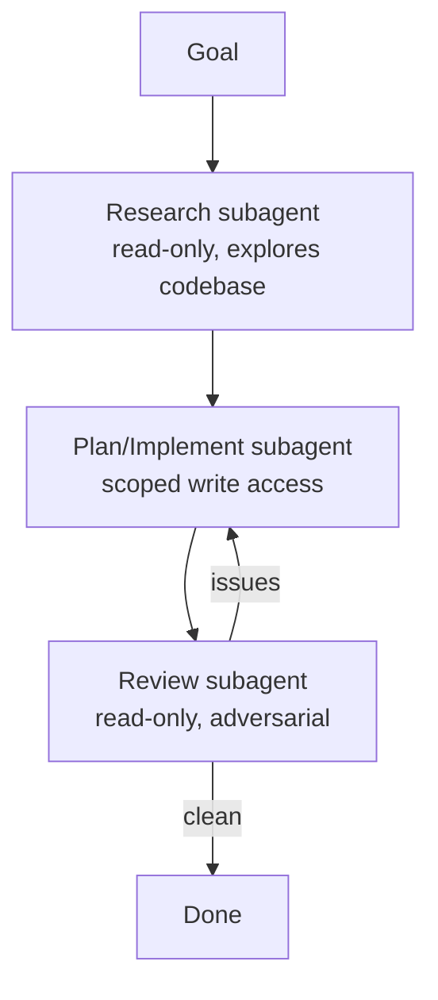

<LevelBadge level="advanced" />

把大型任务拆分给多个聚焦的 [子智能体](/docs/claude-code/subagents)，比把所有内容塞进一个上下文要好得多。让我们设计一条 研究 → 实现 → 审查 的流水线。

## 整体形态

每个子智能体都有**自己的上下文**和**量身定制的工具集** —— 而且只有*结果*会流回主会话，从而让主会话保持干净。

## 第 1 步 — 定义这些智能体

通过 `/agents` 界面定义三个智能体，每个都配以紧凑的 `description`（以便主智能体能正确委派任务）和受限的工具集：

- **researcher（研究者）** —— 仅可读取/搜索。梳理相关代码并返回发现。
- **implementer（实现者）** —— 可以编辑文件并运行测试；将研究者的发现作为输入。
- **reviewer（审查者）** —— 只读、对抗性：查找 bug、遗漏的情况以及违反约定之处。

## 第 2 步 — 通过交接进行编排

主会话将每个阶段的输出传递给下一个阶段：研究 → 实现（利用研究成果）→ 审查（针对实现）。加入一道**审查关卡**：如果审查者发现了问题，就在收尾之前回到实现者那里重新循环。

## 第 3 步 — 知道什么时候*不该*这样做

:::warning 并行/多智能体并非没有代价
- **顺序依赖**（实现需要研究）必须保持顺序执行 —— 不要在顺序至关重要的地方做并行扇出。
- **共享文件写入**可能会发生冲突 —— 用 [git worktree](/docs/claude-code/worktrees) 隔离，或者串行执行。
- 对于小任务，协调开销会超过收益。请将此用于**规模较大、可拆解**的工作。
:::

## 第 4 步 — 验证

一次好的多智能体运行应当呈现：一个聚焦的主上下文（繁重的阅读发生在研究者那里）、一份反映了研究成果的实现，以及一次确实发现了问题（或者可信地给出了通过结论）的审查。如果审查者只是橡皮图章，就把它的提示词改得更**对抗性**一些（"努力找出哪里有问题"）。

## 更进一步

把同样的模式以编程方式实现，就是 [在 API 上构建 Agent](/docs/api/building-agents)，以及诸如 [Cowork 与 Agent 团队](/docs/api/cowork-and-agent-teams) 这样的产品形态。

## 下一步

- [子智能体与并行智能体](/docs/claude-code/subagents)
- [Git Worktree](/docs/claude-code/worktrees)
- [在 API 上构建 Agent](/docs/api/building-agents)
